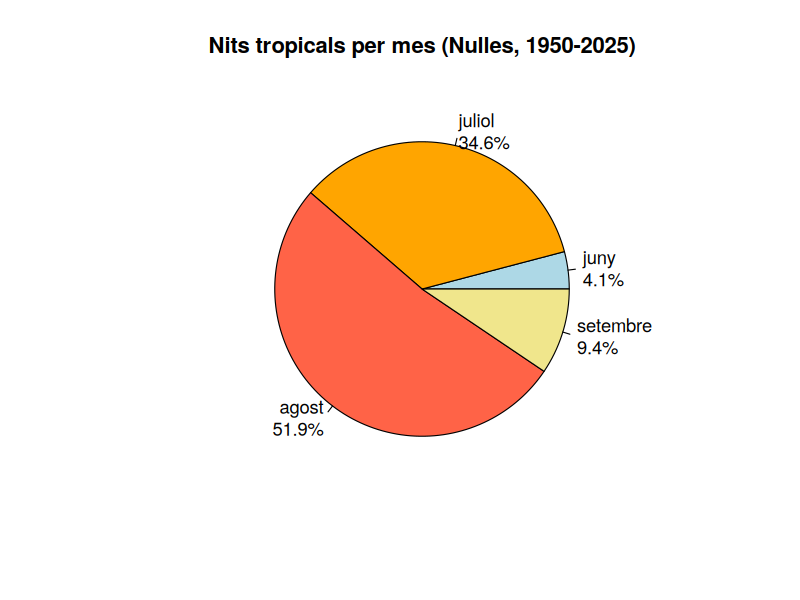
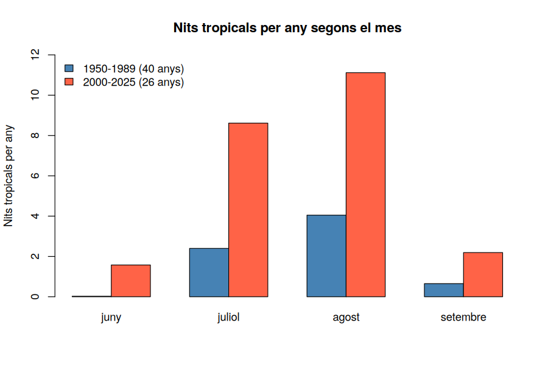
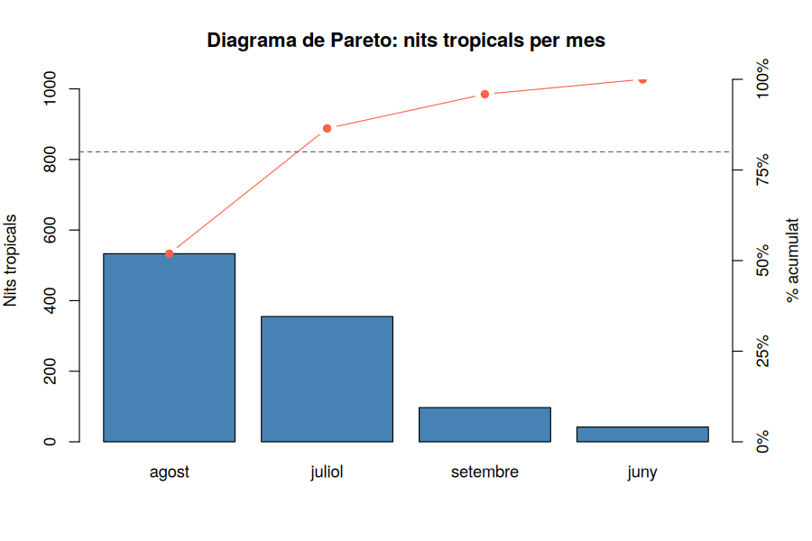

# Activitat 6 — Gràfics I: sectors, barres i Pareto

*Laboratori · Relacionat amb [Bloc 2 — Representacions gràfiques](../teoria/02_representacions_grafiques.md)*

[:material-file-pdf-box: Descarrega l'activitat (PDF)](../assets/laboratori/Activitat6_Grafics_I_Sectors_Barres_Pareto.pdf){ .md-button }

## Context

Fins ara hem sabut **comptar** nits tropicals i organitzar-les en taules. Però una taula de números es llegeix lentament; un bon gràfic, en canvi, es llegeix d'una ullada. En aquesta activitat farem servir tres gràfics del Bloc 2 per respondre dues preguntes sobre les nits tropicals de Nulles (1950–2025):

1. **En quins mesos es concentren?** (sectors i Pareto)
2. **Ha canviat aquest repartiment entre el passat i el present?** (barres agrupades)

La variable que ara estudiem és el **mes** en què es dóna cada nit tropical: una variable qualitativa ordinal (juny, juliol, agost, setembre). Recorda del Bloc 2: per a una variable així els gràfics adequats són el diagrama de **sectors**, el de **barres** i el **diagrama de Pareto** (barres ordenades de més a menys, amb una línia de percentatge acumulat).

## Objectius

- Construir un diagrama de **sectors** i saber quan és (i quan no és) una bona elecció.
- Construir un diagrama de **barres** i un de **barres agrupades** per comparar dos períodes.
- Construir un diagrama de **Pareto** i interpretar la "regla del 80%".
- A Sheets, fer els mateixos gràfics i descobrir què fa fàcilment i què no.

## Part A — Treballem amb R

Primer fem tot el recorregut amb **R** (RStudio). A la Part B repetirem les mateixes operacions amb **Google Sheets**.

### R · Pas 0 — Preparació

Aquesta activitat és independent: si comences una sessió nova de R, cal tornar a carregar les dades i preparar les columnes que ja coneixem de les activitats anteriors. (Recorda que R ha de tenir com a directori de treball la carpeta de l'arxiu: **Session → Set Working Directory → Choose Directory**.)

```r
dades <- read.table("nulles_dades_climatiques_diaries.txt", skip = 11, header = TRUE, sep = "\t")
estiu <- subset(dades, MES %in% c(6, 7, 8, 9))
estiu$tropical <- estiu$TN >= 20
estiu$decada <- (estiu$ANY %/% 10) * 10
tropicals <- subset(estiu, tropical)
nrow(tropicals)   # 1027
```

**Explicació:** és el mateix que vam fer a les Activitats 0–4. L'única novetat és `tropicals <- subset(estiu, tropical)`: com `tropical` ja és `TRUE`/`FALSE`, es pot fer servir directament com a condició, i ens quedem **només amb les 1.027 nits tropicals** d'estiu. *(A l'octubre hi ha 4 nits tropicals més, però en el nostre projecte l'estiu és de juny a setembre, i les deixem fora.)*

### R · Pas 1 — La taula: nits tropicals per mes

```r
mesos <- c("juny", "juliol", "agost", "setembre")
n_mes <- table(factor(tropicals$MES, levels = 6:9, labels = mesos))
n_mes
pct <- round(100 * prop.table(n_mes), 1)
pct
```

**Explicació:**

- `factor(x, levels = 6:9, labels = mesos)`: converteix els números del mes (6, 7, 8, 9) en una variable categòrica amb **etiquetes de text** i en l'ordre que nosaltres triem. Sense això, `table()` ens mostraria "6, 7, 8, 9" i no "juny, juliol...".
- `6:9`: l'operador `:` crea la seqüència `6, 7, 8, 9` (és la forma curta de `c(6, 7, 8, 9)`).
- `table(...)` i `prop.table(...)`: ja els coneixem (Activitat 1). Ens donen $n_i$ i $f_i$.
- `round(x, 1)`: arrodoneix a 1 decimal.

Has d'obtenir:

| Mes | $n_i$ | $f_i$ (%) |
|---|---|---|
| juny | 42 | 4,1% |
| juliol | 355 | 34,6% |
| agost | 533 | 51,9% |
| setembre | 97 | 9,4% |
| **Total** | **1.027** | **100%** |

### R · Pas 2 — Diagrama de sectors amb `pie()`

```r
pie(n_mes,
    labels = paste0(names(n_mes), "\n", pct, "%"),
    col = c("lightblue", "orange", "tomato", "khaki"),
    main = "Nits tropicals per mes (Nulles, 1950-2025)")
```



**Explicació:**

- `pie(x)`: dibuixa un sector circular per a cada valor de `x`; l'angle de cada sector és proporcional a la freqüència (recorda del Bloc 2: angle = $f_i$ · 360º).
- `labels = ...`: el text de cada sector. Aquí el construïm amb `paste0()`.
- `paste0(a, b, c)`: **enganxa** textos sense separador. `names(n_mes)` dona els noms (juny, juliol...), `"\n"` és un **salt de línia**, `pct` els percentatges i `"%"` el símbol.
- `col = c(...)`: un color per sector, en l'ordre de la taula.
- `main = "..."`: el títol.

!!! note "Mini manual R: `names()` i `paste0()`"

    `names(taula)` retorna les etiquetes d'una taula o vector. `paste0("a", 1, "b")` retorna `"a1b"`. Amb `paste()` (sense el 0) s'afegeix un espai entre els elements. Són les dues funcions que més s'utilitzen per construir etiquetes de gràfics.

    **Quan és bona idea un diagrama de sectors?** Quan hi ha **pocs sectors** (3–5) i volem veure "quina part del total" és cada categoria. Aquí funciona bé: agost i juliol són, a ull, més de la meitat i un terç del cercle. Amb 12 mesos seria un caos, i difícil de comparar: l'ull és dolent comparant angles.

### R · Pas 3 — Diagrama de barres amb `barplot()`

El mateix repartiment, ara amb barres (ja vam usar `barplot()` a l'Activitat 5):

```r
barplot(n_mes, col = "steelblue", ylab = "Nits tropicals",
        main = "Nits tropicals per mes (1950-2025)")
```

Les barres permeten comparar alçades amb molta més precisió que els angles d'un sector. Ara anem un pas més enllà: **comparar dos períodes**.

### R · Pas 4 — Barres agrupades: abans i ara

Comparem els anys **1950–1989** (40 anys) amb **2000–2025** (26 anys). Com els períodes no tenen la mateixa durada, no podem comparar nits absolutes: dividirem pel nombre d'anys per obtenir **nits tropicals per any**.

```r
antic  <- subset(tropicals, ANY <= 1989)
recent <- subset(tropicals, ANY >= 2000)

taula <- rbind(
  table(factor(antic$MES,  levels = 6:9, labels = mesos)) / 40,
  table(factor(recent$MES, levels = 6:9, labels = mesos)) / 26
)
round(taula, 2)

barplot(taula, beside = TRUE, col = c("steelblue", "tomato"),
        ylim = c(0, 12), ylab = "Nits tropicals per any",
        main = "Nits tropicals per mes i per any: abans i ara",
        legend.text = c("1950-1989", "2000-2025"))
```



**Explicació:**

- `subset(tropicals, ANY <= 1989)`: filtrem els anys fins al 1989. La segona taula, des del 2000.
- `table(...) / 40`: dividir una taula per un número divideix totes les seves caselles: passem de "nits totals" a "nits **per any**".
- `rbind(a, b)`: ("*row bind*") apila vectors o taules com a **files** d'una taula nova. Obtenim una taula de 2 files (períodes) i 4 columnes (mesos).
- `beside = TRUE`: fa que les barres de cada fila de la taula es posin **una al costat de l'altra** (agrupades). Amb `FALSE` (per defecte) s'apilarien.
- `ylim = c(0, 12)`: fixem l'escala vertical perquè totes les barres càpiguen.
- `legend.text = c(...)`: afegeix la llegenda amb el nom de cada fila.

**Interpretació:** abans, una mitjana de 2,4 nits al juliol i 4,1 a l'agost per any; ara, 8,6 al juliol i 11,1 a l'agost. I el més espectacular: el **juny** passa de 0,03 nits per any a 1,6. La temporada tropical s'ha **intensificat** i també **s'ha allargat** cap als extrems (juny i setembre).

### R · Pas 5 — Diagrama de Pareto

El diagrama de Pareto ordena les categories de **més a menys freqüent** i hi superposa la línia del **percentatge acumulat**. S'utilitza per respondre: *quines poques categories expliquen la major part del fenomen?* (la "regla del 80/20").

```r
ordenat <- sort(n_mes, decreasing = TRUE)
acum <- cumsum(ordenat) / sum(ordenat)
round(100 * acum, 1)

par(mar = c(5, 4, 4, 4))
bp <- barplot(ordenat, ylim = c(0, sum(ordenat)), col = "steelblue",
              ylab = "Nits tropicals", main = "Pareto: nits tropicals per mes")
lines(bp, acum * sum(ordenat), type = "b", pch = 19, col = "tomato")
axis(4, at = seq(0, 1, 0.25) * sum(ordenat), labels = paste0(seq(0, 100, 25), "%"))
abline(h = 0.8 * sum(ordenat), lty = 2)
```



**Explicació línia a línia:**

- `sort(x, decreasing = TRUE)`: ordena de més gran a més petit.
- `cumsum(ordenat) / sum(ordenat)`: la freqüència relativa acumulada $F_i$ (com a l'Activitat 3).
- `par(mar = c(5, 4, 4, 4))`: `par()` configura els paràmetres gràfics; `mar` són els **marges** (baix, esquerra, dalt, dreta). Ampliem el de la dreta perquè hi cabrà el segon eix.
- `bp <- barplot(...)`: `barplot()` **retorna les posicions horitzontals** de les barres; les guardem a `bp`.
- `lines(bp, y, type = "b", pch = 19)`: afegeix una línia al gràfic ja dibuixat. `type = "b"` = punts units per línies; `pch = 19` = punt ple.
- `acum * sum(ordenat)`: com la línia comparteix el gràfic amb les barres, la dibuixem a l'escala de les barres (0–1.027).
- `axis(4, at = ..., labels = ...)`: dibuixa un **eix a la dreta** (el 4) amb les marques i etiquetes de percentatge.
- `abline(h = ..., lty = 2)`: línia horitzontal discontínua al 80%.

**Interpretació:** agost = 51,9%; agost + juliol = 86,5%; + setembre = 95,9%. **Dos mesos de quatre (agost i juliol) ja superen el 80% del total**: les nits tropicals estan molt concentrades a l'agost i el juliol.

## Part B — Treballem amb Google Sheets

Ara fem el mateix amb el full de càlcul, partint de les dades que ja vas importar a l'Activitat 0 (a la pestanya `Dades`: columnes A = ANY, B = MES, ..., F = TN).

### Sheets · Pas 0 — Preparació

Crea una pestanya nova (`estiu`) amb les nits d'estiu, tal com a l'Activitat 2:

```
=FILTRA(Dades!A2:F27760; (Dades!B2:B27760>=6) * (Dades!B2:B27760<=9))
```

*(Aquí hem escrit els quatre mesos de forma més curta: "mes ≥ 6 **i** mes ≤ 9", combinat amb `*`.)*

!!! note "Nota"

    Si el teu Sheets està en anglès, les funcions es diuen `FILTER`, `COUNTIFS`, etc. Les que fem servir als apartats següents tenen sempre un nom en anglès equivalent.

### Sheets · Pas 1 — La taula per mes

Escriu els noms dels mesos a la columna H (H2: `juny`, ... H5: `setembre`) i els números 6–9 a la I. A la J, compta les nits tropicals amb `COMPTA.SI.CONJ`:

```
=COMPTA.SI.CONJ(estiu!B:B; I2; estiu!F:F; ">=20")
```

**Explicació:** `COMPTA.SI.CONJ(rang1; criteri1; rang2; criteri2)` compta les files on es compleixen **totes** les condicions alhora: aquí, "mes = I2" **i** "TN ≥ 20". Fixa't que el criteri numèric amb comparador va **entre cometes**: `">=20"`.

A la K, el percentatge: `=J2/SUMA($J$2:$J$5)` (format %). Els resultats han de coincidir amb la taula de R (42, 355, 533, 97).

### Sheets · Pas 2 — Gràfic de sectors

Selecciona les columnes de nom (H) i recompte (J) → **Inserir → Gràfic** → tipus **Gràfic circular**. A **Personalitza → Gràfic circular** pots mostrar el percentatge a cada sector i canviar-ne els colors.

### Sheets · Pas 3 — Gràfic de columnes i columnes agrupades

Amb les mateixes dades, tria el tipus **Gràfic de columnes**. Per al gràfic **abans / ara**, construeix una taula de dues columnes (nits per any 1950–1989 i 2000–2025):

```
=COMPTA.SI.CONJ(estiu!B:B; I2; estiu!F:F; ">=20"; estiu!A:A; "<=1989") / 40
=COMPTA.SI.CONJ(estiu!B:B; I2; estiu!F:F; ">=20"; estiu!A:A; ">=2000") / 26
```

Selecciona la taula (mesos + 2 columnes) i insereix un gràfic de columnes: Sheets agrupa automàticament les columnes per sèrie.

### Sheets · Pas 4 — Pareto

Sheets **no té un gràfic "Pareto" propi**, però el podem construir amb un **gràfic combinat**:

1. Escriu a la cel·la M2 la fórmula `=ORDENA(H2:J5; 3; FALS)`: ordena la taula (nom, mes, recompte) per la 3a columna, de més a menys, i omple M2:O5 (noms a la M, recompte a la O).
2. A la columna P, calcula l'acumulat: `P2`: `=O2/SUMA($O$2:$O$5)` i `P3`: `=P2+O3/SUMA($O$2:$O$5)` (arrossega fins a P5). L'últim valor ha de ser 1 (100%).
3. Selecciona els noms (M), el recompte (O) i l'acumulat (P) → **Inserir → Gràfic → Gràfic combinat**.
4. A **Personalitza → Sèrie**, assigna la sèrie de l'acumulat a l'**eix dret** i canvia'n el tipus a **Línia**.

El resultat és equivalent al de R, amb una mica més de feina manual.

## Per practicar

a) **Pareto de contrast.** Fes un Pareto dels **dies de pluja** (`PPT ≥ 1` mm) per mes, amb els 12 mesos. Veuràs que cal **9 de 12 mesos** per superar el 80%: la pluja no es concentra (el mes més plujós, el maig, només aporta l'11%). Per què és tan diferent de les nits tropicals? *Pista: `table(factor(subset(dades, PPT >= 1)$MES, levels = 1:12))`.*

b) Fes un diagrama de sectors dels 12 mesos del punt (a). És fàcil de llegir? Compara'l amb el de barres.

c) Repeteix el gràfic de barres agrupades amb **dècades** (1950s, 2010s...) en lloc dels dos períodes.

d) Explica, amb les teves paraules, per què comparem "nits per any" i no "nits totals" en el gràfic d'abans i ara.

## Resum de l'activitat

- Hem representat la distribució mensual de les nits tropicals amb **sectors**, **barres** i **barres agrupades**, i hem après quan convé cada gràfic.
- A R: `pie()`, `barplot(beside = TRUE)`, `factor()`, `rbind()`, `paste0()`, `sort()`, `cumsum()`, `par()`, `lines()`, `axis()`, `abline()`.
- Hem construït un **Pareto**: dos mesos (agost i juliol) concentren el 86,5% de les nits tropicals.
- Hem vist que la temporada tropical s'ha intensificat i allargat (juny i setembre).
- A Sheets, sectors i columnes són gràfics natius; el Pareto es fa amb un gràfic combinat.

**Següent pas (Activitat 7):** passarem de variables qualitatives a la **variable contínua** `TN`: histogrames, polígons de freqüències i gràfics de línies per veure com ha evolucionat al llarg dels anys.
