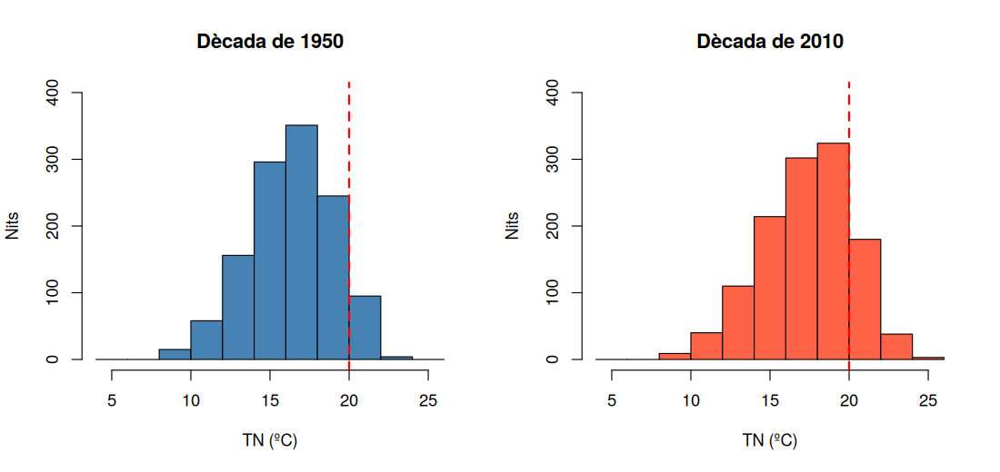
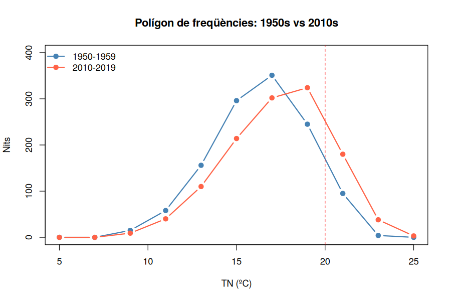
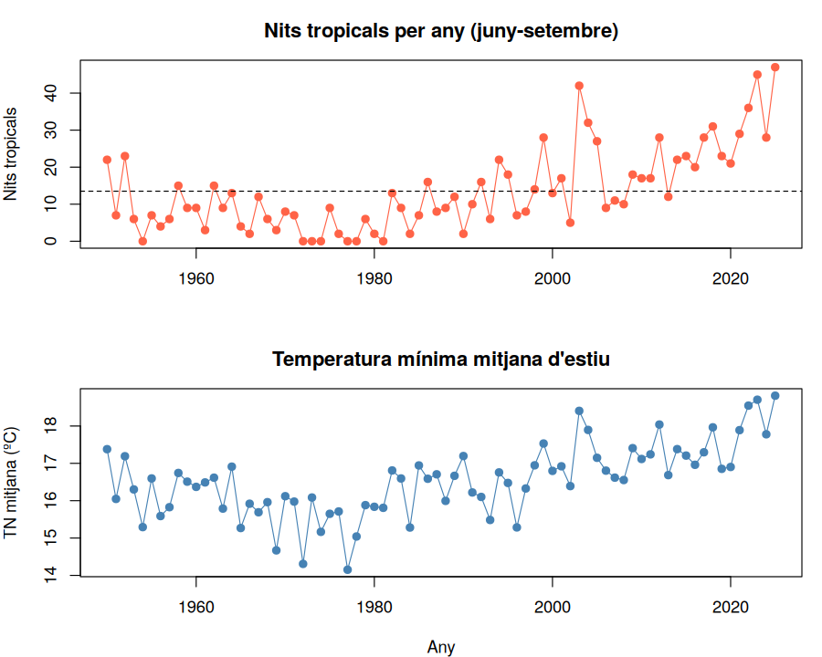

# Activitat 7 — Gràfics II: histogrames, polígons i línies

*Laboratori · Relacionat amb [Bloc 2 — Representacions gràfiques](../teoria/02_representacions_grafiques.md)*

[:material-file-pdf-box: Descarrega l'activitat (PDF)](../assets/laboratori/Activitat7_Grafics_II_Histogrames_Linies.pdf){ .md-button }

## Context

A l'Activitat 6 hem representat una variable qualitativa (el mes). Ara tornem a la temperatura mínima `TN`, que és una **variable quantitativa contínua**, i a la qual (Activitat 3) ja vam aplicar una taula d'intervals. El gràfic que correspon a una taula d'intervals és l'**histograma**: barres **enganxades** (perquè els intervals no tenen buits entre ells) on l'**àrea** representa la freqüència.

Aquest cop farem una pregunta més ambiciosa: *com és la distribució de `TN` a les nits d'estiu, i s'ha desplaçat entre la dècada de 1950 i la de 2010?* Per respondre-la:

- compararem **dos histogrames** (1950s i 2010s) amb **la mateixa escala**,
- els resumirem amb dos **polígons de freqüències** superposats,
- i acabarem amb **gràfics de línies** (sèries temporals) per veure l'evolució any rere any.

## Objectius

- Construir un **histograma** amb `hist()` i entendre el paper dels límits d'interval.
- Comparar dues distribucions amb la mateixa escala i una referència (la línia dels 20 ºC).
- Construir un **polígon de freqüències** a partir de les marques de classe.
- Fer **gràfics de línies** per a una sèrie temporal (any a any).
- A Sheets, utilitzar el gràfic d'histograma i el de línies, i saber què cal fer a mà.

## Part A — Treballem amb R

Primer fem tot el recorregut amb **R** (RStudio). A la Part B repetirem les mateixes operacions amb **Google Sheets**.

### R · Pas 0 — Preparació

```r
dades <- read.table("nulles_dades_climatiques_diaries.txt", skip = 11, header = TRUE, sep = "\t")
estiu <- subset(dades, MES %in% c(6, 7, 8, 9))
estiu$tropical <- estiu$TN >= 20
estiu$decada <- (estiu$ANY %/% 10) * 10

tn50 <- estiu$TN[estiu$decada == 1950]   # TN d'estiu de 1950-1959
tn10 <- estiu$TN[estiu$decada == 2010]   # TN d'estiu de 2010-2019
length(tn50); length(tn10)               # 1220 cadascuna
```

**Explicació:** és la preparació habitual. Una novetat: `estiu$TN[estiu$decada == 1950]` és una altra manera de filtrar. Dins dels claudàtors `[ ]` posem una condició, i R retorna **només els valors de `TN` on la condició és certa**. El resultat és un vector (una llista de números), no una taula. Això és el que necessita `hist()`.

### R · Pas 1 — Un histograma amb `hist()`

```r
br <- seq(4, 26, by = 2)
hist(tn50, breaks = br, right = FALSE, col = "steelblue",
     main = "Nits d'estiu, 1950-1959", xlab = "TN (ºC)", ylab = "Nombre de nits")
```

**Explicació:**

- `hist(x)`: dibuixa l'histograma del vector `x`. Compta quants valors cauen dins de cada interval i dibuixa una barra per interval.
- `breaks = br`: els **límits dels intervals** (com a `cut()`, Activitat 3). `seq(4, 26, by = 2)` dona 4, 6, 8, ..., 26: onze intervals d'amplada 2 ºC.
- `right = FALSE`: igual que a `cut()`: intervals de la forma `[a, b)`. Així el límit de 20 ºC pertany a l'interval `[20, 22)` i les nits tropicals queden separades de les que no ho són.
- `col`, `main`, `xlab`, `ylab`: color, títol, noms dels eixos (ja els coneixem de l'Activitat 5).

!!! note "Mini manual R: l'histograma és una taula d'intervals dibuixada"

    `hist(..., plot = FALSE)` no dibuixa res, però **retorna** la taula d'intervals:

    ```r
    h50 <- hist(tn50, breaks = br, right = FALSE, plot = FALSE)
    h50$counts   # n_i de cada interval
    h50$mids     # marca de classe de cada interval
    ```

    El símbol `$` serveix per obtenir un component d'un resultat (com `dades$TN` obté una columna). Els resultats esperats per als 1950:

    | Interval | [4,6) | [6,8) | [8,10) | [10,12) | [12,14) | [14,16) | [16,18) | [18,20) | [20,22) | [22,24) | [24,26) |
    |---|---|---|---|---|---|---|---|---|---|---|---|
    | $n_i$ (1950s) | 0 | 0 | 15 | 58 | 156 | 296 | 351 | 245 | 95 | 4 | 0 |
    | $n_i$ (2010s) | 0 | 0 | 9 | 40 | 110 | 214 | 302 | 324 | 180 | 38 | 3 |

    (Cadascuna suma 1.220 nits.)

### R · Pas 2 — Dos histogrames, una mateixa escala

Per **comparar**, els dos gràfics han de tenir els mateixos eixos. Si no, l'ull es deixa enganyar.

```r
par(mfrow = c(1, 2))
hist(tn50, breaks = br, right = FALSE, col = "steelblue", main = "Dècada de 1950",
     xlab = "TN (ºC)", ylab = "Nits", ylim = c(0, 400))
abline(v = 20, col = "red", lty = 2, lwd = 2)
hist(tn10, breaks = br, right = FALSE, col = "tomato", main = "Dècada de 2010",
     xlab = "TN (ºC)", ylab = "Nits", ylim = c(0, 400))
abline(v = 20, col = "red", lty = 2, lwd = 2)
par(mfrow = c(1, 1))
```



**Explicació:**

- `par(mfrow = c(1, 2))`: divideix la finestra gràfica en **1 fila i 2 columnes**: els dos gràfics següents s'hi col·loquen un al costat de l'altre. L'última línia, `par(mfrow = c(1, 1))`, ho restableix.
- `ylim = c(0, 400)`: **mateix límit vertical** als dos gràfics.
- `abline(v = 20, ...)`: `v` = línia **v**ertical a `x = 20`. `col = "red"`, `lty = 2` (discontínua), `lwd = 2` (gruix).

**Interpretació:** la forma és semblant (una "campana" una mica asimètrica per l'esquerra), però el **centre s'ha desplaçat cap a la dreta**: el interval més freqüent passa de `[16,18)` (1950s) a `[18,20)` (2010s). I la part de la dreta de la línia vermella (nits tropicals) creix: de 99 nits (8,11%) a 221 (18,11%).

### R · Pas 3 — Polígon de freqüències

El polígon uneix amb línies les **marques de classe** (centres dels intervals) amb la seva freqüència. És molt útil per **superposar** dues distribucions en un sol gràfic.

```r
h10 <- hist(tn10, breaks = br, right = FALSE, plot = FALSE)

plot(h50$mids, h50$counts, type = "b", pch = 19, col = "steelblue", lwd = 2,
     xlab = "TN (ºC)", ylab = "Nits", ylim = c(0, 400),
     main = "Polígon de freqüències: 1950s vs 2010s")
lines(h10$mids, h10$counts, type = "b", pch = 19, col = "tomato", lwd = 2)
abline(v = 20, col = "red", lty = 2)
legend("topleft", legend = c("1950-1959", "2010-2019"),
       col = c("steelblue", "tomato"), lwd = 2, pch = 19, bty = "n")
```



**Explicació:**

- `plot(x, y, type = "b")`: el gràfic més general de R. Dibuixa `y` en funció de `x`. `type = "b"` (*both*) dibuixa punts **i** línies; `"l"` només línia; `"p"` només punts; `"o"` línia amb punts superposats.
- `lines(x, y, ...)`: **afegeix** una segona línia al gràfic ja dibuixat (com a l'Activitat 6).
- `legend("topleft", ...)`: afegeix una llegenda a la cantonada superior esquerra. `bty = "n"` treu el requadre.

Visualment: la corba taronja és la mateixa que la blava, **desplaçada cap a la dreta**.

### R · Pas 4 — Gràfics de línies: l'evolució any a any

Fins ara hem comparat dues dècades. Per veure **tots** els anys, cal una sèrie temporal. Calculem dues coses per any: les nits tropicals, i la `TN` mitjana d'estiu.

```r
anual <- aggregate(tropical ~ ANY, data = estiu, FUN = sum)
names(anual) <- c("ANY", "nits")
tn_any <- aggregate(TN ~ ANY, data = estiu, FUN = mean)

par(mfrow = c(2, 1), mar = c(4, 4, 3, 1))
plot(anual$ANY, anual$nits, type = "o", pch = 19, col = "tomato",
     xlab = "", ylab = "Nits tropicals", main = "Nits tropicals per any (juny-setembre)")
abline(h = mean(anual$nits), lty = 2)
plot(tn_any$ANY, tn_any$TN, type = "o", pch = 19, col = "steelblue",
     xlab = "Any", ylab = "TN mitjana (ºC)", main = "Temperatura mínima mitjana d'estiu")
par(mfrow = c(1, 1))
```



**Explicació:**

- `aggregate(tropical ~ ANY, ..., FUN = sum)`: com a l'Activitat 4, però agrupant **per any** (no per dècada). Obtenim 76 files: les nits tropicals de cada estiu.
- `names(anual) <- c("ANY", "nits")`: **canvia els noms de les columnes** (la segona es deia `tropical`).
- `aggregate(TN ~ ANY, ..., FUN = mean)`: la mitjana de `TN` de cada estiu.
- `par(mfrow = c(2, 1), mar = ...)`: ara 2 files i 1 columna; `mar` ajusta els marges.
- `abline(h = mean(anual$nits), lty = 2)`: línia **h**orizontal a la mitjana (13,5 nits per estiu).

**Interpretació:** els dos gràfics expliquen la mateixa història: un mínim a la dècada de 1970 (anys amb 0 nits tropicals!), un lleuger augment als 1980–90, i una **pujada clara des del 2000**, amb el rècord a 2025 (47 nits). Els anys amunt i avall (la "serra") també ens avisen d'una cosa important: **hi ha molta variabilitat entre anys**. Aquesta variabilitat és el tema de l'Activitat 9.

## Part B — Treballem amb Google Sheets

Ara fem el mateix amb el full de càlcul, partint de les dades de l'Activitat 0.

### Sheets · Pas 0 — Preparació

A la pestanya `estiu` (Activitat 6) ja tens les nits d'estiu. Si no, repeteix:

```
=FILTRA(Dades!A2:F27760; (Dades!B2:B27760>=6) * (Dades!B2:B27760<=9))
```

Per separar les dècades, crea dues pestanyes més amb `FILTRA` i la condició d'any:

```
=FILTRA(Dades!F2:F27760; (Dades!B2:B27760>=6) * (Dades!B2:B27760<=9) * (Dades!A2:A27760>=1950) * (Dades!A2:A27760<=1959))
```

(i la mateixa amb `>=2010` i `<=2019`). Cada una dona una columna de 1.220 valors de `TN`.

### Sheets · Pas 1 — Histograma amb el gràfic d'histograma

1. Selecciona la columna de TN de la dècada de 1950 → **Inserir → Gràfic**.
2. A **Tipus de gràfic** tria **Histograma**.
3. A **Personalitza → Histograma**, posa **Mida del segment = 2**, **Valor mínim = 4** i **Valor màxim = 26**.
4. Afegeix títol i noms d'eixos.

Repeteix-ho per a la dècada de 2010. **Compte:** Sheets decideix l'escala vertical automàticament; perquè la comparació sigui honesta, fixa el mateix màxim als dos gràfics a **Personalitza → Eix vertical**.

!!! note "Nota"

    Aquest gràfic no et permet triar si l'interval és `[a, b)` o `(a, b]`. Si necessites control exacte, construeix la taula a mà amb `FREQÜÈNCIA` (pas següent) i fes un gràfic de columnes.

### Sheets · Pas 2 — Taula d'intervals amb `FREQÜÈNCIA` i polígon

Com a l'Activitat 3, `FREQÜÈNCIA` fa servir el conveni `(a, b]`. Per imitar `[a, b)` restem 0,1 als límits, ja que les temperatures tenen un decimal:

1. Escriu a la columna A les **marques de classe** (5, 7, 9, ..., 25) i a la B els **límits superiors "restats"**: 5,9; 7,9; 9,9; ...; 25,9 (és a dir, el límit de l'interval menys 0,1; a Sheets en català el decimal és la coma).
2. Selecciona 12 cel·les buides a la columna C (11 intervals + 1 per als valors per damunt de l'últim límit) i escriu:

```
=FREQÜÈNCIA(estiu_1950!A:A; B2:B12)
```

*(Tradueix `estiu_1950` pel nom de la teva pestanya amb la TN de la dècada de 1950. Si el teu Sheets està en anglès, la funció és `FREQUENCY`.)*

Resultat: 11 freqüències (més una de 12a, que ha de ser 0). Han de coincidir amb les de R.

**Polígon:** selecciona les marques de classe i les dues columnes de freqüències (1950s i 2010s) → **Inserir → Gràfic → Gràfic de línies** (o **de dispersió amb línies**). Obtindràs les dues corbes superposades, com a R.

### Sheets · Pas 3 — Gràfics de línies per any

1. Nits tropicals per any: a una pestanya nova, escriu els anys 1950–2025 a la columna A i, a la B:
   ```
   =COMPTA.SI.CONJ(estiu!A:A; A2; estiu!F:F; ">=20")
   ```
2. TN mitjana per any, a la C:
   ```
   =MITJANA.SI(estiu!A:A; A2; estiu!F:F)
   ```
3. Selecciona A i B → **Inserir → Gràfic → Gràfic de línies**. Fes-ne un altre amb A i C.
4. Per a la línia de la mitjana, afegeix una columna D amb `=MITJANA($B$2:$B$77)` repetida a totes les files, i inclou-la com a segona sèrie.

## Per practicar

a) Fes l'histograma de la dècada de **2020** (2020–2025, 732 nits). Quin és l'interval modal? *(Resposta esperada: [18,20).)* Per comparar-lo amb els altres, quin tipus de freqüència hauries d'usar (absoluta o relativa) i per què? Recorda que té menys nits.

b) A R, prova `hist(tn50)` **sense** `breaks`. Què tria R per defecte? Quin avantatge té escollir nosaltres els límits?

c) Fes un gràfic de línies de les nits tropicals **només per al juliol** de cada any. És més o menys "serrat" que el de tot l'estiu?

d) Posa en un sol gràfic de línies la TN mitjana d'estiu **i** la de l'hivern (mesos 12, 1, 2). Evoluciona igual?

## Resum de l'activitat

- Hem construït **histogrames** (`hist()`), **polígons de freqüències** i **gràfics de línies** (`plot(type = "o")`).
- Hem après a comparar distribucions amb **la mateixa escala** i una **línia de referència** (`abline`).
- A R: `hist(plot = FALSE)`, `$counts`, `$mids`, `par(mfrow)`, `plot`/`lines`/`legend`, `aggregate` per any, `names()<-`.
- Hem vist que la distribució de `TN` d'estiu s'ha desplaçat prop d'1 ºC cap amunt (de la dècada de 1950 a la de 2010) i que les nits tropicals han passat de ser el 8% a ser el 18% a la dècada de 2010.
- A Sheets, l'histograma i les línies són natius; la taula exacta d'intervals cal fer-la amb `FREQÜÈNCIA`.

**Següent pas (Activitat 8):** resumirem una distribució amb **un sol número**: les mesures de **centralitat** (mitjana, mediana i moda).
