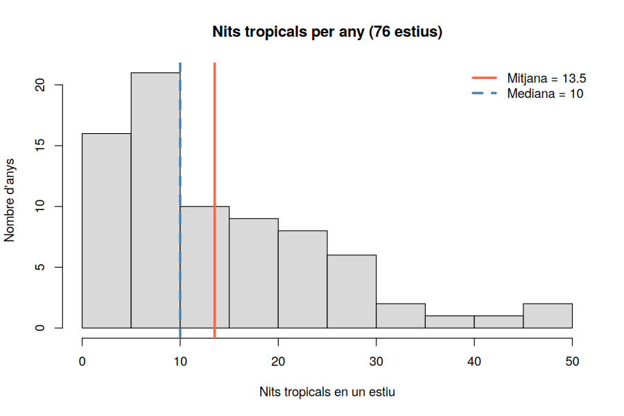
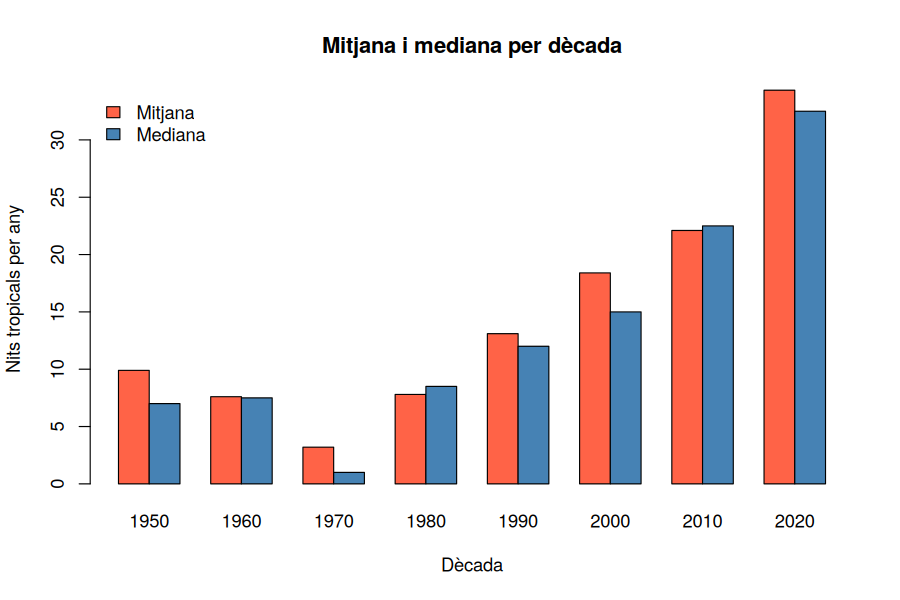

# Activitat 8 — Centralitat: mitjana, mediana i moda

*Laboratori · Relacionat amb [Bloc 3 — Mesures de centralitat](../teoria/03_mesures_centralitat.md)*

[:material-file-pdf-box: Descarrega l'activitat (PDF)](../assets/laboratori/Activitat8_Centralitat_Mitjana_Mediana_Moda.pdf){ .md-button }

## Context

Fins ara hem descrit les dades amb taules i gràfics. Però sovint necessitem **un sol número** que representi tot un conjunt de dades: "un estiu típic a Nulles té ___ nits tropicals". Aquest número és una **mesura de centralitat**, i n'hi ha tres de molt conegudes: la **mitjana**, la **mediana** i la **moda**. Cadascuna respon a una idea diferent de "típic":

- **Mitjana**: el punt d'equilibri de les dades (suma de tots els valors dividida pel nombre de valors).
- **Mediana**: el valor que deixa el 50% de les dades per sota i el 50% per sobre.
- **Moda**: el valor més freqüent.

La variable que estudiem és el **nombre de nits tropicals en un estiu** (juny–setembre), una per any: tenim **76 valors** (1950–2025). Per què interessa? Perquè la pregunta natural és *"quantes nits tropicals té un estiu normal a Nulles?"*, i la resposta depèn de quina mesura triem. Veurem que mitjana i mediana **no coincideixen** i entendrem per què, i comprovarem com **resisteix** cada una a un valor extrem.

## Objectius

- Calcular la mitjana, la mediana i la moda **a partir de la taula de freqüències** i amb les funcions de R.
- Interpretar la diferència entre mitjana i mediana com a senyal d'**asimetria**.
- Comprovar que la mitjana és **sensible als valors extrems** i la mediana no.
- Calcular la mitjana de **dades agrupades** (amb marques de classe) i comparar-la amb la real.
- Comparar la centralitat entre **dècades**.
- Fer-ho a Sheets amb `MITJANA`, `MEDIANA`, `MODA`.

## Part A — Treballem amb R

Primer fem tot el recorregut amb **R** (RStudio). A la Part B repetirem les mateixes operacions amb **Google Sheets**.

### R · Pas 0 — Preparació: les nits tropicals de cada estiu

```r
dades <- read.table("nulles_dades_climatiques_diaries.txt", skip = 11, header = TRUE, sep = "\t")
estiu <- subset(dades, MES %in% c(6, 7, 8, 9))
estiu$tropical <- estiu$TN >= 20

anual <- aggregate(tropical ~ ANY, data = estiu, FUN = sum)
names(anual) <- c("ANY", "nits")
anual$decada <- (anual$ANY %/% 10) * 10

nrow(anual)        # 76 estius
head(anual, 5)
```

**Explicació:** `aggregate(... ~ ANY, FUN = sum)` ens dona una fila per any amb el nombre de nits tropicals (Activitat 7). Renomenem la columna a `nits` i hi afegim la dècada. A partir d'ara treballem amb el vector `anual$nits` (76 números).

### R · Pas 1 — La mitjana, des de la taula de freqüències

Al Bloc 3, la mitjana es calcula amb la fórmula

$$\bar{x} = \sum x_i \cdot f_i = \frac{\sum x_i \cdot n_i}{N}$$

on $x_i$ són els valors diferents, $n_i$ quantes vegades apareix cada un i $N$ el total. Fem-ho **tal com diu la fórmula**:

```r
taula <- table(anual$nits)
xi <- as.numeric(names(taula))
ni <- as.numeric(taula)
N  <- sum(ni)

sum(xi * ni) / N
```

**Explicació:**

- `table(anual$nits)`: quantes vegades apareix cada nombre de nits tropicals (per exemple, "9 nits tropicals" en 7 estius).
- `names(taula)`: els valors diferents $x_i$, però com a **text**. `as.numeric(...)` els converteix en números (no es pot multiplicar un text!).
- `as.numeric(taula)`: les freqüències `n_i` com a números ordinaris.
- `xi * ni`: multiplica **element a element** (el primer per el primer, etc.), i `sum()` ho suma tot.
- Resultat: **13,51** nits tropicals per estiu.

!!! note "Mini manual R: `mean()`, `sum()` i `length()`"

    Per a un vector, R ho fa sense taula:

    ```r
    mean(anual$nits)                      # 13.51
    sum(anual$nits) / length(anual$nits)  # el mateix: suma / quantitat
    ```

    `length(x)` és el nombre d'elements (N). `mean(x)` és exactament `sum(x) / length(x)`. Comprova que els tres càlculs coincideixen: és la millor manera de verificar que has entès la fórmula.

### R · Pas 2 — La mediana

Per trobar la mediana, ordenem els 76 valors i busquem el del mig. Com que 76 és **parell**, no hi ha un únic valor central: n'hi ha dos (el 38è i el 39è) i prenem la **mitjana dels dos** (Bloc 3).

```r
ordenats <- sort(anual$nits)
ordenats[38:39]
mean(ordenats[38:39])

median(anual$nits)
```

**Explicació:**

- `sort(x)`: ordena de més petit a més gran.
- `ordenats[38:39]`: els **elements 38 i 39** del vector (els claudàtors serveixen per triar posicions; `38:39` és la seqüència 38, 39). Surt 10 i 10.
- `median(x)`: ho fa tot d'una vegada. Resultat: **10** nits.

**Primera conclusió:** mitjana = 13,5 > mediana = 10. *La meitat dels estius tenen 10 nits tropicals o menys*, però alguns estius molt calorosos fan pujar la mitjana.

### R · Pas 3 — La moda

La moda és el valor amb més repeticions. Només cal mirar quin `n_i` és el màxim de la taula:

```r
taula[taula == max(taula)]
names(taula)[taula == max(taula)]
```

**Explicació:**

- `max(taula)`: la freqüència més alta (7).
- `taula == max(taula)`: per a cada valor, `TRUE` si la seva freqüència és el màxim.
- `taula[...]`: ens quedem només amb aquests valors.
- Resultat: els valors **0 i 9** nits tropicals (7 estius cadascun). És una distribució **bimodal** (Bloc 3).

!!! note "Mini manual R: compte amb `mode()`!"

    A R, la funció `mode()` **no** calcula la moda estadística: només diu de quin *tipus* és un objecte (`"numeric"`, `"character"`...). Per a la moda cal fer el que hem fet amb `table()`.

### R · Pas 4 — Mitjana contra mediana: l'asimetria

```r
hist(anual$nits, breaks = seq(0, 50, by = 5), right = FALSE, col = "grey85",
     main = "Nits tropicals per any (76 estius)",
     xlab = "Nits tropicals en un estiu", ylab = "Nombre d'anys")
abline(v = mean(anual$nits),   col = "tomato",    lwd = 3)
abline(v = median(anual$nits), col = "steelblue", lwd = 3)
legend("topright", legend = c("mitjana", "mediana"),
       col = c("tomato", "steelblue"), lwd = 3, bty = "n")
```



**Interpretació:** la distribució té una **cua llarga cap a la dreta** (pocs estius amb moltes nits: 42, 45, 47...). Això estira la mitjana cap a la dreta, mentre que la mediana (que només depèn de la posició) es queda més aprop de la majoria. **Regla pràctica:** si mitjana > mediana, la distribució és **asimètrica per la dreta**; si mitjana < mediana, per l'esquerra.

Comprova-ho amb la temperatura mínima de **totes les nits d'estiu**:

```r
mean(estiu$TN)     # 16.54
median(estiu$TN)   # 16.8
```

Aquí passa el contrari: mitjana (16,54) < mediana (16,8), una cua cap a l'esquerra (algunes nits d'estiu fresques tiren la mitjana cap avall).

### R · Pas 5 — Sensibilitat als valors extrems

Agafem la dècada de 2000, amb els valors de nits tropicals dels seus 10 estius:

```r
x <- anual$nits[anual$decada == 2000]
x                    # 13 17 5 42 32 27 9 11 10 18
mean(x)              # 18.4
median(x)            # 15
```

Ara imaginem un **error de teclat**: el quart valor (42) l'escrivim 420 per equivocació.

```r
y <- x
y[4] <- 420
mean(y)              # 56.2
median(y)            # 15
```

**Explicació:** `y[4] <- 420` canvia **només** el quart element del vector. La mitjana s'ha triplicat (de 18,4 a 56,2); la mediana **no s'ha mogut**. Diem que la mediana és **robusta** davant dels valors extrems, mentre que la mitjana és **sensible**.

### R · Pas 6 — Per dècades

```r
aggregate(nits ~ decada, data = anual, FUN = mean)
aggregate(nits ~ decada, data = anual, FUN = median)

mitjanes <- aggregate(nits ~ decada, data = anual, FUN = mean)
barplot(mitjanes$nits, names.arg = mitjanes$decada, col = "tomato",
        xlab = "Dècada", ylab = "Nits tropicals per estiu",
        main = "Nits tropicals per estiu: mitjana per dècada")
```

Has d'obtenir:

| Dècada | Mitjana | Mediana |
|---|---|---|
| 1950 | 9,9 | 7 |
| 1960 | 7,6 | 7,5 |
| 1970 | 3,2 | 1 |
| 1980 | 7,8 | 8,5 |
| 1990 | 13,1 | 12 |
| 2000 | 18,4 | 15 |
| 2010 | 22,1 | 22,5 |
| 2020 (6 anys) | 34,3 | 32,5 |



**Interpretació:** en el període 1950–1979 un estiu "típic" té 7 nits tropicals o menys; a la dècada del 2010, **22** (tres vegades més); als primers sis anys de la dècada de 2020, **més de 30**. Fixa't també que mitjana i mediana **s'acosten** quan la distribució és més simètrica (2010s: 22,1 i 22,5) i s'allunyen quan hi ha un estiu extrem (2000s: 18,4 i 15; el 2003 va tenir 42 nits).

### R · Pas 7 — Mitjana de dades agrupades

Amb dades en intervals, no coneixem els valors exactes: fem servir la **marca de classe** $m_i$ de cada interval (Bloc 3):

$$\bar{x} \approx \frac{\sum m_i \cdot n_i}{N}$$

Ho fem per a la `TN` de les nits d'estiu 2020–2025:

```r
tn20 <- estiu$TN[estiu$ANY >= 2020]
h <- hist(tn20, breaks = seq(4, 26, by = 2), right = FALSE, plot = FALSE)
sum(h$mids * h$counts) / sum(h$counts)   # mitjana agrupada: 18.42
mean(tn20)                               # mitjana real:     18.11
```

**Explicació:** `h$mids` són les marques de classe (5, 7, ..., 25) i `h$counts` les freqüències (`n_i`). La mitjana agrupada (18,42) és una **aproximació**: sobreestima una mica la real (18,11) perquè suposem que tots els valors d'un interval valen el centre. Si tenim les dades originals, **sempre** és preferible `mean()`; l'agrupada és el que ens quedaria si només tinguéssim la taula (com en un article o un informe).

La mediana exacta és `median(tn20)` = 18,5 ºC. A partir de la taula, l'interval mediana és `[18,20)`: és el primer en què la freqüència acumulada passa el 50% (278 nits per sota de 18, 526 per sota de 20; necessitem 366).

## Part B — Treballem amb Google Sheets

Ara fem el mateix amb el full de càlcul, partint de les dades de l'Activitat 0.

### Sheets · Pas 0 — Les nits tropicals de cada estiu

En una pestanya nova, escriu els anys 1950–2025 a la columna A. A la B:

```
=COMPTA.SI.CONJ(Dades!A:A; A2; Dades!B:B; ">=6"; Dades!B:B; "<=9"; Dades!F:F; ">=20")
```

**Explicació:** compta les files on l'any és A2, el mes és entre 6 i 9 (dos criteris sobre la mateixa columna) i `TN ≥ 20`. Obtindràs els 76 valors. Si el teu Sheets està en anglès, la funció és `COUNTIFS`.

### Sheets · Pas 1 — Mitjana, mediana i moda

```
=MITJANA(B2:B77)
=MEDIANA(B2:B77)
=MODA(B2:B77)
```

**Explicació:** donen 13,51, 10 i 0. Compte: **`MODA` retorna només un valor** (el primer en cas d'empat), de manera que **no et dirà que la distribució és bimodal**. Per veure-ho tot, fes la taula de freqüències: a la columna D escriu 0, 1, 2, ..., 47 i a la E `=COMPTA.SI($B$2:$B$77; D2)`. Busca els valors amb la freqüència màxima (0 i 9, amb 7 estius).

La mitjana "des de la taula", com a la fórmula del Bloc 3:

```
=SUMAPRODUCTE(D2:D49; E2:E49) / SUMA(E2:E49)
```

`SUMAPRODUCTE(a; b)` multiplica **element a element** i suma: és exactament $\sum x_i \cdot n_i$. Ha de donar 13,51, com `MITJANA`.

### Sheets · Pas 2 — Sensibilitat als extrems

Copia els 10 valors dels anys 2000–2009 a una columna (`=B52:B61`). Calcula `MITJANA` i `MEDIANA` (18,4 i 15). Canvia el 42 per 420 i observa com la mitjana es dispara i la mediana no.

### Sheets · Pas 3 — Per dècades

```
=MITJANA.SI(C2:C77; 1950; B2:B77)
```

(on la columna C té la dècada de cada any: `=ENT(A2/10)*10`). Sheets no té una funció `MEDIANA.SI`, però es pot fer amb:

```
=MEDIANA(FILTRA(B2:B77; C2:C77=1950))
```

Construeix la taula de les 8 dècades i fes-ne un gràfic de columnes (com a l'Activitat 5).

### Sheets · Pas 4 — Mitjana de dades agrupades

Amb la taula d'intervals de l'Activitat 7 (marques de classe a la columna A i freqüències a la B):

```
=SUMAPRODUCTE(A2:A12; B2:B12) / SUMA(B2:B12)
```

## Per practicar

a) Calcula la mitjana, la mediana i la moda de les nits tropicals de la dècada de **1970** (3,2 / 1 / ?). Per què la moda és molt més baixa que a la dècada de 2010?

b) Quina de les tres mesures descriu millor "un estiu típic" de la dècada de 2000? Argumenta-ho tenint en compte el 2003 (42 nits).

c) Calcula la mitjana de `TN` d'estiu per a la dècada de **1950** i la de **2020**, primer amb `mean()` i després amb marques de classe. Quin és l'error de l'aproximació en cada cas?

d) La mitjana de la precipitació diària (`PPT`) a Nulles és molt baixa perquè la majoria de dies no plou (`PPT = 0`). Calcula `mean(dades$PPT)` i `median(dades$PPT)`. Què et diu la comparació?

## Resum de l'activitat

- Hem calculat **mitjana**, **mediana** i **moda** a partir de la taula i amb funcions de R (`mean`, `median`, `table`), i amb Sheets (`MITJANA`, `MEDIANA`, `MODA`, `SUMAPRODUCTE`).
- Hem vist que **mitjana > mediana** indica una cua cap a la dreta (nits tropicals per any) i que **mitjana < mediana** indica una cua cap a l'esquerra (TN d'estiu).
- Hem comprovat que la **mediana és robusta** i la **mitjana és sensible** a un valor extrem.
- La mitjana de dades agrupades és una **aproximació** (18,42 vs 18,11).
- Un estiu "típic" a Nulles ha passat de ~7 nits tropicals (1950–1979) a ~22 (dècada de 2010).

**Següent pas (Activitat 9):** una mitjana no ho explica tot. Quin és el **marge de variació** al voltant seu? Passem a les mesures de **dispersió**.
