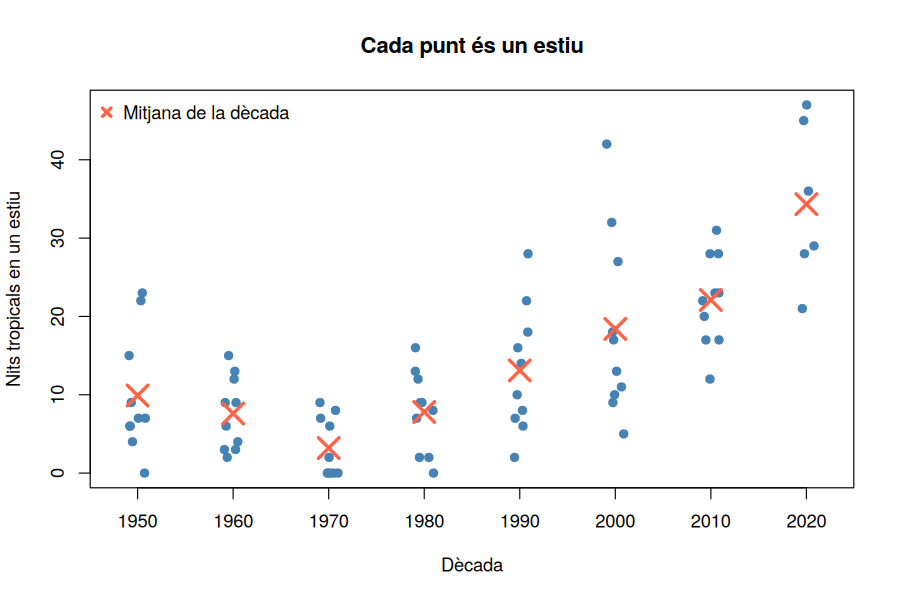

# Activitat 9 — Dispersió: rang, variància i desviació típica

*Laboratori · Relacionat amb [Bloc 4 — Mesures de dispersió](../teoria/04_desviacio_tipica.md)*

[:material-file-pdf-box: Descarrega l'activitat (PDF)](../assets/laboratori/Activitat9_Dispersio_Rang_Variancia_Desviacio.pdf){ .md-button }

## Context

A l'Activitat 8 hem dit que un estiu "típic" de la dècada de 2010 té uns 22 nits tropicals. Però dues dècades poden tenir **la mateixa mitjana** i ser molt diferents: en una, tots els estius s'assemblen; en l'altra, uns són freds i uns altres extrems. Una mitjana, sola, **amaga** aquesta diferència. Necessitem un segon número que digui **com de dispersos són els valors al voltant del centre**: una **mesura de dispersió**.

Al Bloc 4 hem vist el **rang** (màxim − mínim), la **variància** $s^2$ i la **desviació típica** $s$, i el teorema de **Txebixev**, que ens diu quina proporció de dades hi ha, com a mínim, dins de $\pm 2s$ i $\pm 3s$ de la mitjana. En aquesta activitat ho aplicarem a dues variables del nostre projecte:

- **Nits tropicals per estiu** (76 valors, una per any): molt variable.
- **`TN` de totes les nits d'estiu** (1.220 per dècada): molt més estable.

La pregunta de fons: *el clima de Nulles no només s'ha escalfat, sinó que també s'ha fet més "imprevisible"?*

## Objectius

- Calcular el **rang**, la **variància** i la **desviació típica**, primer **a mà** (amb un exemple petit) i després amb R.
- Entendre per què la `var()` i la `sd()` de R no coincideixen exactament amb les del curs (divisor `n` o `n−1`), i definir la nostra pròpia funció.
- Comparar la dispersió entre **dècades**.
- Aplicar **Txebixev** i comprovar-ne el compliment amb dades reals.
- Fer-ho a Sheets amb `MAX`, `MIN`, `VAR.P`, `DESVEST.P`.

## Part A — Treballem amb R

Primer fem tot el recorregut amb **R** (RStudio). A la Part B repetirem les mateixes operacions amb **Google Sheets**.

### R · Pas 0 — Preparació

```r
dades <- read.table("nulles_dades_climatiques_diaries.txt", skip = 11, header = TRUE, sep = "\t")
estiu <- subset(dades, MES %in% c(6, 7, 8, 9))
estiu$tropical <- estiu$TN >= 20
estiu$decada <- (estiu$ANY %/% 10) * 10

anual <- aggregate(tropical ~ ANY, data = estiu, FUN = sum)
names(anual) <- c("ANY", "nits")
anual$decada <- (anual$ANY %/% 10) * 10
```

**Explicació:** com a l'Activitat 8: `anual` té una fila per any amb les nits tropicals de l'estiu, i `estiu` conté totes les nits de juny a setembre.

### R · Pas 1 — El rang

```r
x <- anual$nits
max(x) - min(x)
range(x)
```

**Explicació:** `max()` i `min()` donen el valor més gran i més petit; `range()` retorna els dos alhora (Activitat 3). Les nits tropicals per estiu van de **0 a 47**: rang = 47.

El rang és fàcil, però **depèn només de dos valors**, els extrems: un únic estiu atípic el canvia. Per això en busquem de millors.

### R · Pas 2 — Variància i desviació típica, a mà

Fem el càlcul pas a pas amb un conjunt petit: les nits tropicals dels **sis estius de 2020–2025**: 21, 29, 36, 45, 28, 47.

```r
y <- c(21, 29, 36, 45, 28, 47)
n <- length(y)
m <- mean(y)          # 34.33
desv <- y - m         # desviacions respecte a la mitjana
desv
desv^2                # desviacions al quadrat
sum(desv^2)           # 523.33
var_n <- sum(desv^2) / n   # variància: 87.22
sqrt(var_n)                # desviació típica: 9.34
```

**Explicació, columna a columna:**

| Estiu | $x_i$ | $x_i - \bar{x}$ | $(x_i - \bar{x})^2$ |
|---|---|---|---|
| 2020 | 21 | −13,33 | 177,78 |
| 2021 | 29 | −5,33 | 28,44 |
| 2022 | 36 | 1,67 | 2,78 |
| 2023 | 45 | 10,67 | 113,78 |
| 2024 | 28 | −6,33 | 40,11 |
| 2025 | 47 | 12,67 | 160,44 |
| **Suma** | | **0** | **523,33** |

- `y - m`: R resta `m` a **cada** element del vector (operació vectorial).
- Les desviacions sumen **0** (la mitjana és el punt d'equilibri); per això no podem usar-les directament: les elevem al **quadrat** perquè no es cancel·lin.
- `desv^2`: l'operador `^` és la potència.
- Variància $s^2 = \dfrac{\sum (x_i-\bar{x})^2}{n} = \dfrac{523{,}33}{6} = 87{,}22$.
- Desviació típica $s = \sqrt{s^2} = 9{,}34$ nits tropicals. És en les **mateixes unitats** que les dades (nits), cosa que la variància (nits²) no té. Per això s'interpreta $s$ com "una desviació habitual respecte a la mitjana".

!!! note "Mini manual R: `var()` i `sd()` (divisor `n−1`)"

    R té funcions ja fetes, però **atenció**: `var()` i `sd()` divideixen per **`n − 1`**, no per `n`:

    ```r
    sd(y)    # 10.23   (divisor n-1)
    ```

    Al Bloc 4 hem fet servir el divisor **`n`**. Per tant, **no coincideixen** (9,34 vs 10,23). Per obtenir la del curs, definim la nostra pròpia funció:

    ```r
    sd_n <- function(x) sqrt(mean((x - mean(x))^2))
    sd_n(y)  # 9.34
    ```

    **Explicació:** `function(x) ...` crea una funció nova que rep un vector `x`. Dins fa `mean((x - mean(x))^2)` (la mitjana dels quadrats de les desviacions, és a dir, la variància amb divisor `n`) i en treu l'arrel. A partir d'ara `sd_n()` està disponible com qualsevol altra funció.

    Quan `n` és gran la diferència desapareix: amb les 1.220 `TN` d'una dècada surt 2,650 vs 2,651. Per això, amb pocs valors (com els sis anys de la dècada de 2020) ens importa molt quina fórmula fem servir; amb molts, no.

### R · Pas 3 — La dispersió de tot el conjunt

```r
mean(x)     # 13.51
sd_n(x)     # 11.00
sd_n(x)^2   # variància: 121
```

La desviació típica (11 nits) és comparable a la mitjana (13,5): els estius són **molt diferents entre si**. Amb dades tan dispersides, la mitjana és una descripció pobra d'un estiu concret.

### R · Pas 4 — Per dècades

```r
aggregate(nits ~ decada, data = anual, FUN = sd_n)
aggregate(nits ~ decada, data = anual, FUN = function(v) max(v) - min(v))
```

**Explicació:** a `FUN` podem passar la nostra funció `sd_n`, o escriure'n una **al moment** sense nom (`function(v) max(v) - min(v)`). Resultats:

| Dècada | Mitjana | Desv. típica (`sd_n`) | Rang |
|---|---|---|---|
| 1950 | 9,9 | 7,24 | 0–23 |
| 1960 | 7,6 | 4,43 | 2–15 |
| 1970 | 3,2 | 3,63 | 0–9 |
| 1980 | 7,8 | 4,94 | 0–16 |
| 1990 | 13,1 | 7,62 | 2–28 |
| 2000 | 18,4 | 11,14 | 5–42 |
| 2010 | 22,1 | 5,56 | 12–31 |
| 2020 (6 anys) | 34,3 | 9,34 | 21–47 |

**Interpretació:** la dispersió **no puja de manera ordenada** com la mitjana. La dècada del 2000 és la més dispersa (`s` = 11,1: va tenir estius de 5 i de 42 nits), mentre que la de 2010 és sorprenentment regular (`s` = 5,6: tots els estius entre 12 i 31). **Una mitjana alta no implica una dispersió alta** (ni baixa): són dues informacions independents.

### R · Pas 5 — Veure la dispersió

```r
mitjanes <- aggregate(nits ~ decada, data = anual, FUN = mean)

stripchart(nits ~ decada, data = anual, vertical = TRUE, method = "jitter",
           pch = 19, col = "steelblue",
           xlab = "Dècada", ylab = "Nits tropicals en un estiu",
           main = "Cada punt és un estiu")
points(1:8, mitjanes$nits, pch = 4, lwd = 3, cex = 2, col = "tomato")
```



**Explicació:**

- `stripchart(y ~ grup, vertical = TRUE)`: dibuixa **cada dada com un punt**, en una columna per grup. Permet veure alhora el centre i la dispersió sense resumir res.
- `method = "jitter"`: **desplaça lleugerament** els punts en horitzontal perquè no se superposin quan hi ha valors repetits.
- `points(x, y, pch = 4)`: afegeix punts a un gràfic ja fet. Aquí, les mitjanes per dècada, com a creus vermelles (`pch = 4`; `cex` és la mida; `1:8` són les posicions de les vuit columnes).

Es veu clarament la columna del 2000 molt "allargada" i la del 2010 més "compacta".

### R · Pas 6 — Txebixev amb dades reals

El teorema de Txebixev (Bloc 4) assegura que, **sigui quina sigui la distribució**, almenys el **75%** de les dades és dins de $\bar{x} \pm 2s$ i almenys el **89%** dins de $\bar{x} \pm 3s$. Comprovem-ho:

```r
m <- mean(x); s <- sd_n(x)
c(m - 2 * s, m + 2 * s)                  # [-8.49, 35.52]
mean(x >= m - 2 * s & x <= m + 2 * s)    # 0.947  (72 de 76)
mean(x >= m - 3 * s & x <= m + 3 * s)    # 0.987  (75 de 76)
```

**Explicació:** `x >= a & x <= b` dona `TRUE` per als valors dins de l'interval; `mean()` d'un vector lògic és la **proporció de `TRUE`** (Activitat 1).

**Interpretació:** el teorema es compleix amb molt de marge: 94,7% ≥ 75% i 98,7% ≥ 89%. (Txebixev dona un mínim garantit; en distribucions "amb forma de campana" el percentatge real sol ser molt més alt.) Fixa't que l'interval `[−8,5; 35,5]` inclou **valors negatius**, que són impossibles per a "nits": és un senyal que aquesta distribució és molt asimètrica.

### R · Pas 7 — La `TN` d'estiu: dispersió estable, mitjana creixent

Ara una variable molt menys dispersa: la temperatura mínima de **cada nit** d'estiu.

```r
tn50 <- estiu$TN[estiu$decada == 1950]
tn10 <- estiu$TN[estiu$decada == 2010]
c(mean(tn50), sd_n(tn50))   # 16.35  2.65
c(mean(tn10), sd_n(tn10))   # 17.27  2.82

aggregate(TN ~ decada, data = estiu, FUN = sd_n)
```

| Dècada | Mitjana de TN | Desv. típica |
|---|---|---|
| 1950 | 16,35 | 2,65 |
| 1960 | 15,97 | 2,73 |
| 1970 | 15,41 | 2,56 |
| 1980 | 16,32 | 2,70 |
| 1990 | 16,43 | 2,87 |
| 2000 | 17,09 | 2,75 |
| 2010 | 17,27 | 2,82 |
| 2020 | 18,11 | 2,72 |

**Interpretació:** la mitjana puja uns 2,7 ºC (de 15,4 a 18,1) però la desviació típica **es manté entre 2,6 i 2,9 ºC**: la distribució s'ha **desplaçat** sense ensanxar-se. I això **explica per què les nits tropicals augmenten tan ràpid**: el llindar de 20 ºC és a la cua alta de la distribució, i un petit desplaçament del centre afecta molt els valors de la cua.

Txebixev, també aquí:

```r
mean(abs(tn50 - mean(tn50)) <= 2 * sd_n(tn50))   # 0.953
mean(abs(tn50 - mean(tn50)) <= 3 * sd_n(tn50))   # 0.999
```

(`abs()` és el valor absolut: $|x-\bar{x}| \le 2s$ és una altra manera d'escriure $\bar{x}-2s \le x \le \bar{x}+2s$.) Surt 95,3% i 99,9%: molt per sobre dels mínims de Txebixev (75% i 89%), com era d'esperar en una distribució en forma de campana.

## Part B — Treballem amb Google Sheets

Ara fem el mateix amb el full de càlcul, partint de les dades de l'Activitat 0.

### Sheets · Pas 0 — Preparació

Com a l'Activitat 8: a la pestanya `anual`, els anys 1950–2025 a la columna A, les nits tropicals de cada estiu a la B (amb `COMPTA.SI.CONJ`) i la dècada a la C (`=ENT(A2/10)*10`).

### Sheets · Pas 1 — Rang, variància i desviació típica

```
=MAX(B2:B77) - MIN(B2:B77)
=VAR.P(B2:B77)
=DESVEST.P(B2:B77)
```

**Explicació:** `VAR.P` i `DESVEST.P` (la **P** és de "població") divideixen per **`n`**: són les que coincideixen amb el curs (11,00 i 121). Les versions `VAR.S` i `DESVEST.S` (o `DESVEST`) divideixen per `n−1`, com `sd()` de R. **Aquí, a Sheets, no cal definir cap funció**: només triar la que acaba en `.P`.

Per fer el càlcul "a mà", tal com a R: escriu els sis valors del 2020–2025 a la columna E, a la F `=E2-MITJANA($E$2:$E$7)`, a la G `=F2^2`, i a sota `=SUMA(G2:G7)/6` (variància) i `=ARREL(G8)` (desviació típica). Has d'obtenir 87,22 i 9,34.

### Sheets · Pas 2 — Per dècades

```
=DESVEST.P(FILTRA(B2:B77; C2:C77=2000))
```

`FILTRA` agafa només les nits tropicals dels anys de la dècada 2000, i `DESVEST.P` n'agafa la desviació (11,14). Fes la taula de les 8 dècades i un gràfic de columnes.

### Sheets · Pas 3 — Txebixev

Amb la mitjana a H1 i la desviació a H2:

```
=COMPTA.SI.CONJ(B2:B77; ">="&(H1-2*H2); B2:B77; "<="&(H1+2*H2)) / COMPTA(B2:B77)
```

**Explicació:** `">="&(H1-2*H2)` construeix el criteri com a text (`&` enganxa textos i números). Dona 72/76 = 94,7%.

### Sheets · Pas 4 — Què no es pot fer fàcilment

Sheets no té un gràfic "stripchart". Es pot imitar amb un **gràfic de dispersió**: l'eix X és la dècada (columna C) i l'eix Y, les nits (columna B). Els punts d'una mateixa dècada es **superposen** en una línia vertical, sense "jitter", però es veu igual l'amplada.

## Per practicar

a) Calcula `sd_n` de les nits tropicals de la dècada de **1970** (3,63) i la de **1950** (7,24). Les mitjanes (3,2 i 9,9) són molt diferents; i la dispersió *relativa* ($s/\bar{x}$)? Aquest quocient, el **coeficient de variació**, permet comparar dispersions de dades amb mitjanes diferents. *(Reptiu: quin és més variable en termes relatius, el 1970 o el 1950?)*

b) Per què, a la dècada de 2020 (només 6 anys), `sd()` de R (10,23) i `sd_n()` (9,34) difereixen tant? Fes la mateixa comparació amb tots els 76 estius.

c) Calcula el rang de la `TN` d'estiu de cada dècada. Té sentit comparar-los tenint en compte que la dècada de 2020 té 732 nits i les altres 1.220?

d) Comprova Txebixev amb la `TN` d'estiu de la dècada de 2010 (resultat esperat: 96,1% a $\pm 2s$ i 99,8% a $\pm 3s$).

## Resum de l'activitat

- Hem calculat el **rang**, la **variància** ($\sum (x-\bar{x})^2/n$) i la **desviació típica** a mà i amb R, i hem vist que `var()` i `sd()` de R divideixen per `n−1`: per això definim `sd_n()`.
- A Sheets, `VAR.P` i `DESVEST.P` coincideixen amb el curs.
- Hem comprovat que la **dispersió i la mitjana són informacions independents**: la dècada de 2010 té una mitjana alta i poca dispersió; la de 2000, una mitjana menor i molta dispersió.
- La `TN` d'estiu s'ha **desplaçat** (+2,7 ºC des de la dècada de 1970) però **no s'ha ensanxat** ($s$ ≈ 2,7 ºC): per això les nits tropicals augmenten tant.
- Hem comprovat el teorema de **Txebixev** amb dades reals.

**Següent pas (Activitat 10):** una altra manera de mesurar el centre i la dispersió sense dependre de la mitjana: els **percentils**, els **quartils** i el **diagrama de caixa (boxplot)**, per comparar dècades d'una ullada.
