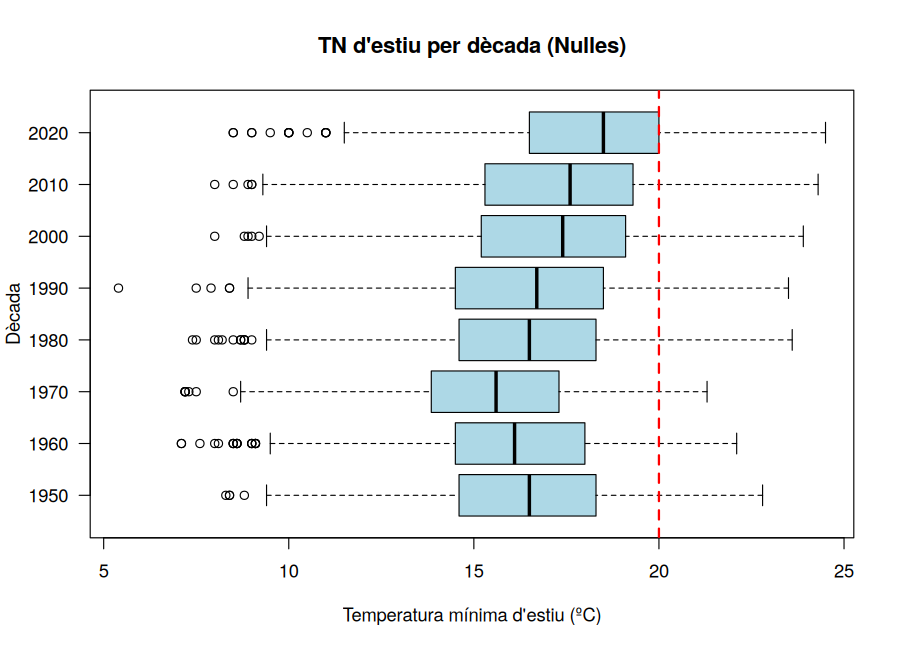
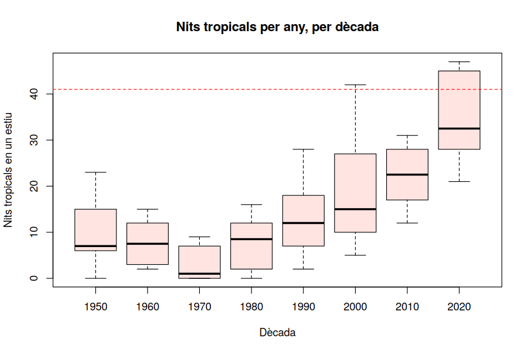

# Activitat 10 — Percentils, quartils i diagrama de caixa

*Laboratori · Relacionat amb [Bloc 5 — Percentils, quartils i boxplot](../teoria/05_percentils_boxplot.md)*

[:material-file-pdf-box: Descarrega l'activitat (PDF)](../assets/laboratori/Activitat10_Percentils_Quartils_Boxplot.pdf){ .md-button }

## Context

La mitjana i la desviació típica (Activitats 8 i 9) són molt útils, però tenen un punt feble: **es deixen influir pels valors extrems**. Els **percentils** ofereixen una altra manera, més robusta, de descriure una distribució: el **percentil p** és el valor que deixa per sota el *p*% de les dades. Els tres més importants són els **quartils**: Q1 (percentil 25), Q2 = mediana (percentil 50) i Q3 (percentil 75). La distància Q3 − Q1 és el **rang interquartílic** (IQR) i mesura la dispersió del 50% central de les dades.

Amb aquests cinc números (mínim, Q1, mediana, Q3, màxim) es construeix el **diagrama de caixa** (*boxplot*), el gràfic estrella per **comparar grups**. És exactament el que volem fer: comparar les **vuit dècades** de la temperatura mínima d'estiu a Nulles, i veure d'una ullada què ha passat amb **el llindar dels 20 ºC** que defineix la nit tropical.

Aquesta activitat ens permetrà respondre preguntes concretes:

- *Quin percentil és els 20 ºC a la dècada de 1950? I a la de 2020?*
- *Com han canviat Q1, la mediana i Q3 de dècada en dècada?*
- *Quins estius són "atípics" (outliers)?*

## Objectius

- Calcular **percentils i quartils** amb `quantile()` seguint la definició del curs (`type = 1`).
- Interpretar un valor com a **posició** dins de la distribució (en quin percentil és el llindar de 20 ºC).
- Construir i llegir un **boxplot**, calculant a mà els **límits** $Q_1 - 1{,}5 \cdot IQR$ i $Q_3 + 1{,}5 \cdot IQR$ per detectar valors atípics.
- Comparar **dècades** amb boxplots paral·lels.
- Fer-ho a Sheets amb `QUARTIL` i `PERCENTIL`, i conèixer les limitacions de Sheets amb el boxplot.

## Part A — Treballem amb R

Primer fem tot el recorregut amb **R** (RStudio). A la Part B repetirem les mateixes operacions amb **Google Sheets**.

### R · Pas 0 — Preparació

```r
dades <- read.table("nulles_dades_climatiques_diaries.txt", skip = 11, header = TRUE, sep = "\t")
estiu <- subset(dades, MES %in% c(6, 7, 8, 9))
estiu$tropical <- estiu$TN >= 20
estiu$decada <- (estiu$ANY %/% 10) * 10

anual <- aggregate(tropical ~ ANY, data = estiu, FUN = sum)
names(anual) <- c("ANY", "nits")
anual$decada <- (anual$ANY %/% 10) * 10

tn50 <- estiu$TN[estiu$decada == 1950]
```

**Explicació:** com abans: `estiu` són totes les nits de juny a setembre, `anual` té una fila per estiu amb el nombre de nits tropicals, i `tn50` és el vector de les 1.220 temperatures mínimes dels estius de 1950–1959.

### R · Pas 1 — Percentils i quartils amb `quantile()`

```r
quantile(tn50, probs = c(0.25, 0.5, 0.75), type = 1)
quantile(tn50, probs = 0.90, type = 1)
```

**Explicació:**

- `quantile(x, probs = ...)`: retorna els percentils indicats. `probs` són **proporcions** entre 0 i 1: `0.25` és el percentil 25, `0.9` el percentil 90.
- `type = 1`: R té **nou mètodes diferents** per calcular percentils (que només difereixen una mica quan les dades són poques). El **tipus 1** és el que correspon a la definició del Bloc 5: *el primer valor $x_i$ tal que $N_i / N \ge p$* (la freqüència acumulada arriba al *p*). Si no l'indiquem, R fa servir el tipus 7 per defecte.
- Resultat, per a la dècada de 1950: **Q1 = 14,6; mediana = 16,5; Q3 = 18,3 ºC**; el percentil 90 és 19,8 ºC.

**Lectura:** el 25% de les nits d'estiu dels anys 50 va tenir una mínima de 14,6 ºC o menys; el 50% central, entre 14,6 i 18,3 ºC; i només un 10% va superar els 19,8 ºC.

```r
q <- quantile(tn50, c(0.25, 0.75), type = 1)
IQR(tn50, type = 1)       # 3.7
q[[2]] - q[[1]]           # el mateix: Q3 - Q1
```

**Explicació:** `IQR()` fa directament `Q3 − Q1`. Els dobles claudàtors `q[[1]]` agafen el primer element **sense el nom** (`25%`), de manera que es poden fer operacions netes.

### R · Pas 2 — En quin percentil és el llindar de 20 ºC?

Els quartils responen a "quin valor deixa el 25% per sota?". Ara fem la pregunta **inversa**: "*aquest valor, quin percentatge de dades deixa per sota?*"

```r
mean(tn50 < 20)        # 0.9189
f <- ecdf(tn50)
f(19.9)                # 0.9189
```

**Explicació:**

- `mean(tn50 < 20)`: el que hem fet des de l'Activitat 1: la proporció de `TRUE` d'un vector lògic. Dona la fracció de nits **no tropicals**.
- `ecdf(x)` (*empirical cumulative distribution function*) retorna una **funció**: la freqüència relativa acumulada `F`. `f(19.9)` és la fracció de dades `≤ 19,9`.

Així, a la dècada de 1950 el llindar de 20 ºC es troba al **percentil 91,9**: només el 8,1% de les nits el superaven. Per a totes les dècades:

```r
sapply(split(estiu$TN, estiu$decada), function(v) mean(v < 20))
```

**Explicació:** `split(x, grup)` **divideix** un vector en una llista de vectors, un per grup (aquí, una per dècada). `sapply(llista, funció)` aplica la funció a **cada element** de la llista i en retorna els resultats juntats. És un `aggregate` més flexible.

| Dècada | 1950 | 1960 | 1970 | 1980 | 1990 | 2000 | 2010 | 2020 |
|---|---|---|---|---|---|---|---|---|
| % de nits amb TN < 20 | 91,9 | 93,8 | 97,4 | 93,6 | 89,3 | 84,9 | 81,9 | 71,9 |

**Interpretació:** el llindar de 20 ºC ha baixat del **percentil 92** al **percentil 72**. Dit d'una altra manera: de cada 100 nits d'estiu, a la dècada de 1950 en 8 es superaven 20 ºC; a la de 2020, en **28**.

### R · Pas 3 — El boxplot

```r
boxplot(tn50, horizontal = TRUE, col = "lightblue",
        xlab = "Temperatura mínima d'estiu (ºC)", main = "TN d'estiu, 1950-1959")
```

**Com es llegeix un boxplot (Bloc 5):**

- La **caixa** va de Q1 a Q3 (el 50% central de les dades); la seva amplada és l'IQR.
- La **línia gruixuda** dins la caixa és la **mediana**.
- Els **bigotis** arriben fins al valor més extrem que està dins dels **límits**:

$$\text{límit inferior} = Q_1 - 1{,}5\cdot IQR, \qquad \text{límit superior} = Q_3 + 1{,}5\cdot IQR$$

- Els valors **fora** d'aquests límits es dibuixen com a **punts aïllats**: són els **valors atípics** (*outliers*).

Per als anys 50: `IQR = 3,7`, així el límit inferior és 14,6 − 1,5 · 3,7 = **9,05** i el superior, 18,3 + 1,5 · 3,7 = **23,85**. Les nits amb TN < 9,05 són atípiques.

!!! note "Mini manual R: límits a mà"

    ```r
    Q1 <- q[[1]]; Q3 <- q[[2]]; iqr <- Q3 - Q1
    c(Q1 - 1.5 * iqr, Q3 + 1.5 * iqr)         # 9.05  23.85
    sum(tn50 < Q1 - 1.5 * iqr | tn50 > Q3 + 1.5 * iqr)   # nombre d'atípics: 4
    ```

    L'operador `|` és el **"o"** lògic (`&` és "i"). `sum()` d'un vector lògic compta els `TRUE`. Tindrem 4 nits atípiques (totes per sota: les més fredes de l'estiu).

### R · Pas 4 — Comparar dècades: boxplots paral·lels

```r
boxplot(TN ~ decada, data = estiu, horizontal = TRUE, col = "lightblue",
        xlab = "Temperatura mínima d'estiu (ºC)", ylab = "Dècada",
        main = "TN d'estiu per dècada (Nulles)")
abline(v = 20, col = "red", lty = 2, lwd = 2)
```



**Explicació:**

- `boxplot(TN ~ decada, data = estiu)`: la mateixa notació de fórmula que a `aggregate()` (Activitat 4): "`TN` segons `decada`". Dibuixa **una caixa per a cada dècada**.
- `horizontal = TRUE`: caixes horitzontals (així les etiquetes de dècada es llegeixen millor).
- `abline(v = 20, ...)`: la línia vermella dels 20 ºC.

**Interpretació:** la caixa **es desplaça cap a la dreta**, dècada a dècada, des dels anys 70 (la més freda). A la dècada de 2020 el **Q3 ja coincideix amb la línia dels 20 ºC**: una quarta part de les nits d'estiu són tropicals. L'amplada de la caixa (IQR) és **gairebé constant** (3,5–4,0): la distribució es desplaça sense canviar de forma, tal com vam veure amb la desviació típica a l'Activitat 9.

Fixa't també que tots els atípics són **per sota**, mai per damunt: les nits d'estiu excepcionalment càlides no són un fenomen d'extrems, sinó de **desplaçament de tota la distribució**.

### R · Pas 5 — Taula resum per dècada

Amb `split()` i `sapply()` construïm la taula dels cinc números i els límits per a totes les dècades d'un sol cop:

```r
resum <- sapply(split(estiu$TN, estiu$decada), function(v) {
  q <- quantile(v, c(0.25, 0.5, 0.75), type = 1)
  iqr <- q[[3]] - q[[1]]
  c(Q1 = q[[1]], mediana = q[[2]], Q3 = q[[3]], IQR = iqr,
    LI = q[[1]] - 1.5 * iqr, LS = q[[3]] + 1.5 * iqr,
    baixos = sum(v < q[[1]] - 1.5 * iqr),
    alts   = sum(v > q[[3]] + 1.5 * iqr),
    p90 = quantile(v, 0.9, type = 1)[[1]])
})
t(round(resum, 2))
```

**Explicació:**

- `function(v) { ... }`: la funció que apliquem a cada dècada, escrita amb diverses línies entre claus `{ }`. Calcula quartils, IQR, límits i el nombre d'atípics de cada dècada, i ho retorna amb `c(...)`.
- `sapply` ho col·loca en una matriu amb una columna per dècada; `t()` la **transposa** (intercanvia files i columnes) perquè quedi una fila per dècada; `round(x, 2)` arrodoneix.

Has d'obtenir:

| Dècada | Q1 | Mediana | Q3 | IQR | Límit inf. | Límit sup. | Atípics baixos | Atípics alts | P90 |
|---|---|---|---|---|---|---|---|---|---|
| 1950 | 14,6 | 16,5 | 18,3 | 3,7 | 9,05 | 23,85 | 4 | 0 | 19,8 |
| 1960 | 14,5 | 16,1 | 18,0 | 3,5 | 9,25 | 23,25 | 19 | 0 | 19,1 |
| 1970 | 13,8 | 15,6 | 17,3 | 3,5 | 8,55 | 22,55 | 7 | 0 | 18,4 |
| 1980 | 14,6 | 16,5 | 18,3 | 3,7 | 9,05 | 23,85 | 12 | 0 | 19,6 |
| 1990 | 14,5 | 16,7 | 18,5 | 4,0 | 8,50 | 24,50 | 5 | 0 | 20,1 |
| 2000 | 15,2 | 17,4 | 19,1 | 3,9 | 9,35 | 24,95 | 5 | 0 | 20,4 |
| 2010 | 15,3 | 17,5 | 19,3 | 4,0 | 9,30 | 25,30 | 5 | 0 | 20,8 |
| 2020 | 16,5 | 18,5 | 20,0 | 3,5 | 11,25 | 25,25 | 14 | 0 | 21,5 |

**Interpretació:** el **percentil 90** és un bon "indicador de nit càlida": passa de 19,8 ºC (anys 50) a 21,5 ºC (anys 20) i **supera els 20 ºC** per primer cop a la dècada de 1990. Dit d'una altra forma: a la dècada del 2020, el 10% de les nits més càlides de l'estiu són totes tropicals.

!!! note "Nota sobre `boxplot()` i el tipus 1"

    El `boxplot()` de R calcula Q1 i Q3 amb un mètode lleugerament diferent (els *quarts de caixa* o *hinges*, que equivalen a `fivenum()`). Amb moltes dades la diferència és minúscula (per als anys 50 donen exactament 14,6 / 16,5 / 18,3), però amb pocs valors pot canviar una mica. Per això, per al curs, **els quartils que calculem amb `quantile(type = 1)` són els oficials**; el dibuix serveix per comparar.

### R · Pas 6 — Boxplot de les nits tropicals per any

Fem el mateix amb el nombre de nits tropicals de cada estiu, comparant dècades:

```r
boxplot(nits ~ decada, data = anual, col = "mistyrose",
        xlab = "Dècada", ylab = "Nits tropicals en un estiu",
        main = "Nits tropicals per any, per dècada")

q <- quantile(anual$nits, c(0.25, 0.5, 0.75), type = 1)
q                                      # 6  10  20
iqr <- q[[3]] - q[[1]]                 # 14
LS <- q[[3]] + 1.5 * iqr               # 41
abline(h = LS, col = "red", lty = 2)
anual[anual$nits > LS, ]               # estius atípics
```



**Explicació:**

- `anual[anual$nits > LS, ]`: seleccionem les **files** de `anual` on es compleix la condició (el `, ]` final vol dir "totes les columnes"). Ens diu quins anys superen el límit.

**Interpretació:** amb els 76 estius, Q1 = 6, mediana = 10, Q3 = 20, IQR = 14, i el límit superior és **41**. Hi ha **tres estius atípics**: **2003 (42 nits), 2023 (45) i 2025 (47)**. Dos són molt recents! El 2003, que a l'Activitat 8 semblava extrem, va ser un cas excepcional **llavors**; avui, el 2023 i el 2025 el superen.

Però fixa't: **dins de cada dècada**, el boxplot no marca cap atípic (els bigotis arriben fins a 42 i 47). **"Atípic" depèn del grup amb què es compara.** Un estiu amb 42 nits és extrem respecte al conjunt 1950–2025, però dins de la dècada de 2000 o 2020 és un cas més o menys esperable.

Els percentils també ens donen el "estiu normal i el dolent": amb `quantile(anual$nits, c(0.1, 0.9), type = 1)` surt **2 i 28**: el 10% dels estius va tenir 2 nits o menys; el 10% més calorós, 28 o més.

## Part B — Treballem amb Google Sheets

Ara fem el mateix amb el full de càlcul, partint de les dades de l'Activitat 0.

### Sheets · Pas 0 — Preparació

Necessitarem les nits d'estiu d'una dècada. Com a l'Activitat 7:

```
=FILTRA(Dades!F2:F27760; (Dades!B2:B27760>=6) * (Dades!B2:B27760<=9) * (Dades!A2:A27760>=1950) * (Dades!A2:A27760<=1959))
```

Posa el resultat a una pestanya (`tn1950`); la columna A té 1.220 valors.

### Sheets · Pas 1 — Quartils i percentils

```
=QUARTIL(tn1950!A:A; 1)
=QUARTIL(tn1950!A:A; 3)
=PERCENTIL(tn1950!A:A; 0,9)
```

**Explicació:**

- `QUARTIL(dades; n)`: `n` = 0 (mínim), 1 (Q1), 2 (mediana), 3 (Q3) o 4 (màxim).
- `PERCENTIL(dades; p)`: `p` entre 0 i 1 (`0,9` en català és el percentil 90).
- **Compte:** Sheets **interpola** entre valors, com el tipus 7 de R, no fa servir "el primer $x_i$ amb $F_i \ge p$". Amb moltes dades (1.220) els resultats són pràcticament iguals als de R (14,6 / 16,5 / 18,3); amb poques (els 6 anys de 2020–2025) **poden diferir**.

L'IQR: `=QUARTIL(...; 3) - QUARTIL(...; 1)`. Els límits: `=Q1 - 1,5*IQR` i `=Q3 + 1,5*IQR`.

### Sheets · Pas 2 — En quin percentil és el llindar de 20 ºC?

```
=COMPTA.SI(tn1950!A:A; "<20") / COMPTA(tn1950!A:A)
```

**Explicació:** `COMPTA.SI` compta les cel·les amb `TN < 20`, i `COMPTA` el total de números. Dona 0,9189 (91,9%). A Sheets també existeix `RANG.PERCENTIL(dades; valor)`, que retorna el percentil d'un valor concret.

### Sheets · Pas 3 — Taula resum per dècada

Fes una fila per dècada i, per a cada una, filtra amb `FILTRA`:

```
=QUARTIL(FILTRA(Dades!F2:F27760; (Dades!B2:B27760>=6)*(Dades!B2:B27760<=9)*(Dades!A2:A27760>=A2)*(Dades!A2:A27760<=A2+9)); 1)
```

(amb la dècada d'inici a `A2`: 1950, 1960...). Repeteix canviant l'`1` final per 2 i 3 per a la mediana i Q3. Afegeix columnes per a l'IQR i els límits. Per a la dècada de 2020, que només té 6 anys, el límit superior de l'any (`A2+9`) no cal canviar-lo: simplement no hi ha dades posteriors al 2025.

### Sheets · Pas 4 — El boxplot: el que Sheets no fa

**Google Sheets no té un gràfic de caixa (boxplot).** És una limitació real de l'eina. Hi ha dues sortides:

1. **El gràfic de "candlestick"** (*gràfic de canelobre*): **Inserir → Gràfic → Gràfic de canelobre**. Accepta quatre sèries (mínim, Q1, Q3, màxim) i dibuixa una caixa de Q1 a Q3 amb línies fins als extrems: **s'hi assembla molt**, però no marca la mediana ni calcula els atípics automàticament, i s'ha d'ordenar bé les columnes.
2. **Una taula amb format condicional** com la del Pas 3, on els valors de la mediana es poden comparar d'una ullada amb una **escala de colors** (**Format → Format condicional → Escala de colors**).

Aquesta és una bona raó per fer servir R: el que és una línia en R (`boxplot(TN ~ decada, ...)`) és un petit projecte en Sheets.

## Per practicar

a) Calcula, amb `quantile(type = 1)`, el **Q1, la mediana i el Q3** de la `TN` d'estiu de la dècada de **2020** (resposta: 16,5 / 18,5 / 20,0). Què vol dir que Q3 = 20? Comprova-ho amb `mean(TN >= 20)`.

b) Quin és el **percentil 5** i el **percentil 95** de la `TN` d'estiu del conjunt 1950–2025? Interpreta'ls.

c) Fes un boxplot comparant només **dues dècades** (1950 i 2010) amb `boxplot(TN ~ decada, data = subset(estiu, decada %in% c(1950, 2010)))`. Quines diferències destaquen? (centre, amplada, atípics...)

d) Fes els boxplots paral·lels de la **temperatura màxima d'estiu** (`TX`) per dècada. Es desplaça tant com `TN`?

e) A la dècada de 2020, `median()` dona 32,5 nits tropicals per estiu, però `quantile(..., 0.5, type = 1)` en dona **29**. Per què? *(Pista: n = 6 és parell. Quin dels dos mètodes fa la mitjana dels dos valors centrals?)*

## Resum de l'activitat

- Hem après a calcular **percentils** i **quartils** amb `quantile(type = 1)` (la definició del curs) i l'**IQR**.
- Hem interpretat un valor com a **posició**: el llindar de 20 ºC ha passat del **percentil 92** (anys 50) al **percentil 72** (anys 20).
- Hem construït i llegit **boxplots**, calculat a mà els límits $Q_1 - 1{,}5 \cdot IQR$ i $Q_3 + 1{,}5 \cdot IQR$, i identificat els valors atípics.
- Hem comparat vuit dècades: la distribució de `TN` **es desplaça** cap amunt (la mediana puja de 16,5 a 18,5 ºC) **sense canviar de forma** (l'IQR és gairebé constant).
- Hem vist que "atípic" depèn del conjunt amb què es compara: els estius amb 42, 45 i 47 nits tropicals (2003, 2023 i 2025) són atípics respecte a tota la sèrie.
- A Sheets, `QUARTIL` i `PERCENTIL` funcionen (amb interpolació), però **no hi ha boxplot natiu**.

**Tancament del recorregut (Blocs 1–5):** hem passat de les dades brutes a taules, gràfics, resums de centre, dispersió i posició, sempre sobre el mateix conjunt de dades. Tot plegat ens prepara per al següent bloc del curs: la **relació entre dues variables** (correlació i regressió), on ens preguntarem, per exemple, *quant augmenten les nits tropicals cada any?*
