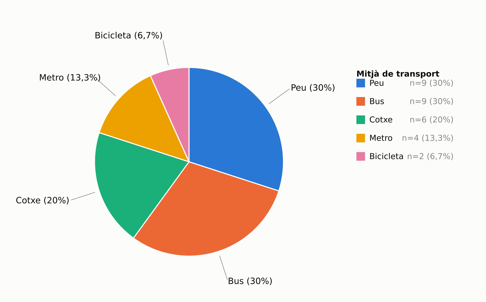
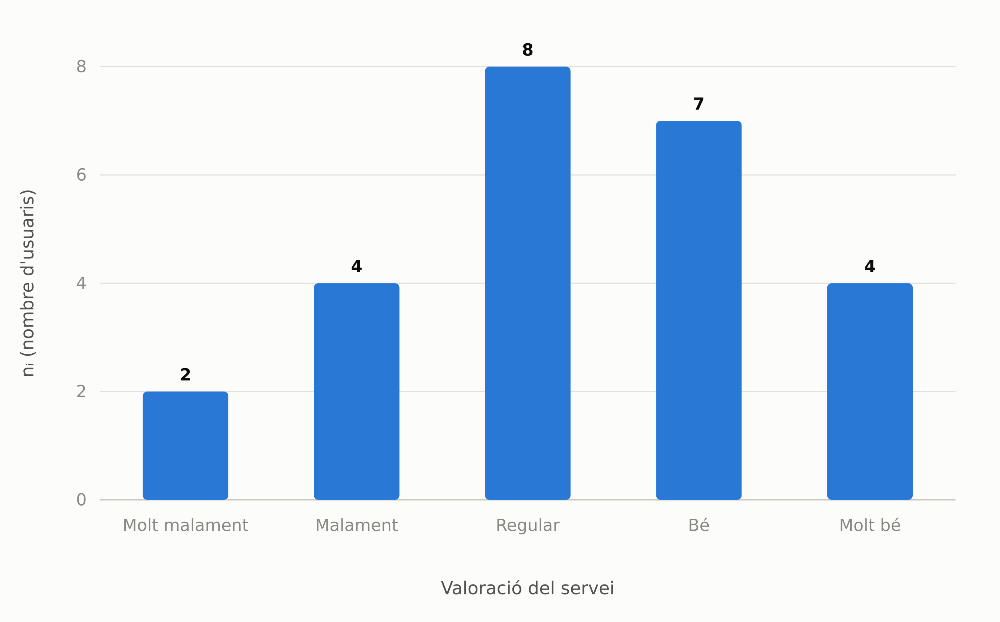
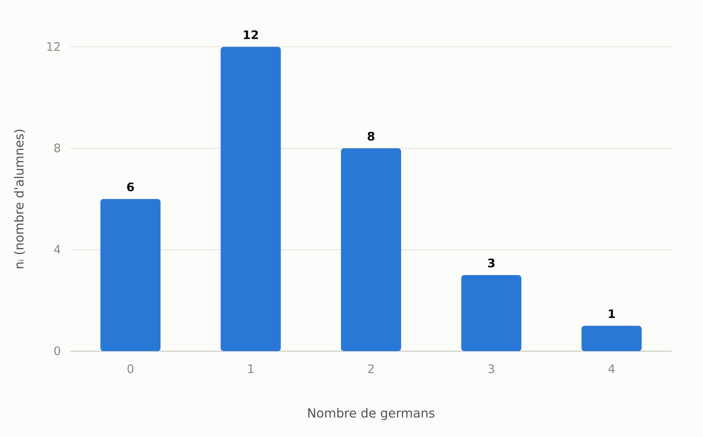
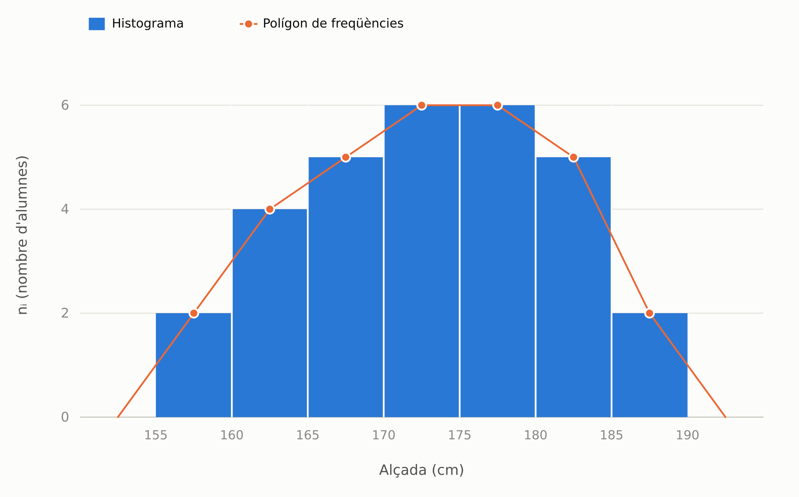
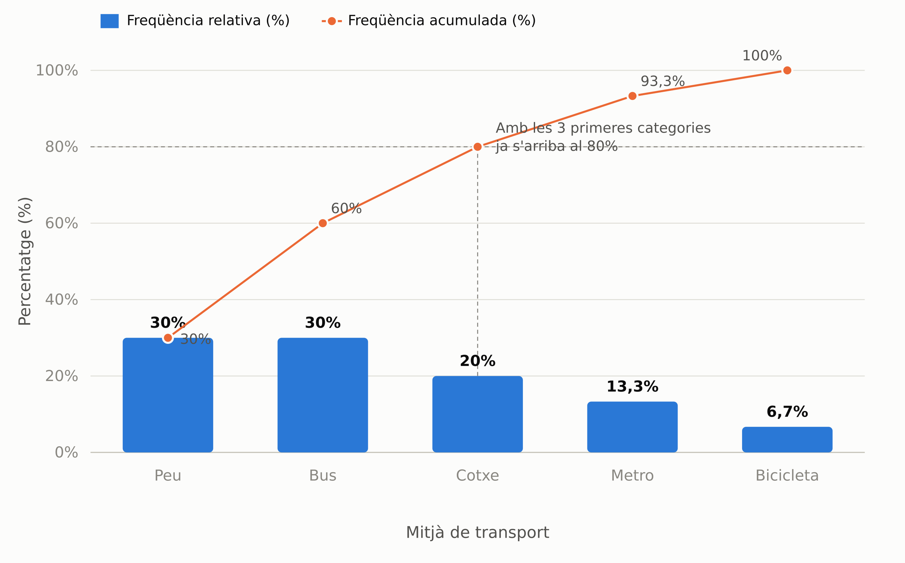

# Bloc 2 — Representacions gràfiques

Al [Bloc 1](01_taules_frequencia.md) vam veure quin gràfic li correspon a cada tipus
de variable:

| Tipus de variable | Gràfic recomanat |
|---|---|
| Qualitativa nominal | Diagrama de sectors (o de barres, sense ordre fix) |
| Qualitativa ordinal | Diagrama de barres (categories en el seu ordre) |
| Quantitativa discreta | Diagrama de barres (una barra per cada $x_i$) |
| Quantitativa contínua | Histograma i, opcionalment, polígon de freqüències |

En aquest bloc veiem cada un d'aquests gràfics en detall, **reutilitzant les
mateixes taules de freqüències del Bloc 1**. També hi afegim un gràfic nou: el
**diagrama de Pareto**.

!!! abstract "Definició: diagrama de sectors"

    Representa cada categoria com una porció d'un cercle: l'angle (i l'àrea) de cada
    porció és proporcional al seu pes sobre el total. La suma de totes les porcions és
    el 100% de les dades.

    Adequat per a variables **qualitatives nominals** amb poques categories.

!!! example "**Exemple:** mitjà de transport (Bloc 1, Exemple 1)"

    

!!! abstract "Definició: diagrama de barres"

    Una barra **separada** per cada categoria o valor, amb una alçada proporcional a
    la freqüència. Les barres van separades perquè cada categoria és una unitat
    diferenciada, no un tram d'un rang continu.

    - **Nominal:** l'ordre de les barres és arbitrari (no hi ha ordre natural).
    - **Ordinal:** les barres es col·loquen seguint l'ordre natural de les categories.
    - **Discreta:** una barra per cada valor $x_i$, també en ordre.

!!! example "**Exemple:** valoració d'un servei, variable ordinal (Bloc 1, Exemple 2)"

    

!!! example "**Exemple:** nombre de germans, variable discreta (Bloc 1, Exemple 3)"

    

!!! abstract "Definició: histograma i polígon de freqüències"

    Per a variables **contínues**, agrupades en intervals:

    - **Histograma:** barres **enganxades**, sense separació entre elles — a diferència del diagrama de barres, aquí no té sentit deixar espai, perquè els intervals són consecutius i cobreixen tot el rang de valors.
    - **Polígon de freqüències:** una línia que uneix els punts (marca de classe, $n_i$) de cada interval; sol dibuixar-se sobre el mateix histograma, i es "tanca" a zero mig interval abans del primer i mig interval després de l'últim.

!!! example "**Exemple:** alçades agrupades en intervals (Bloc 1, Exemple 4)"

    

!!! abstract "Definició: diagrama de Pareto"

    Combina dues idees en un mateix gràfic:

    - Un **diagrama de barres**, amb les categories ordenades de **més a menys freqüents**.
    - Una **línia de freqüències acumulades**, que mostra quin percentatge del total s'acumula a mesura que afegim categories.

    Serveix per identificar ràpidament quines poques categories concentren la major
    part de les dades (el conegut "principi del 80/20").

!!! example "**Exemple:** mitjà de transport, ordenat per freqüència"

    

    Les tres categories més freqüents (Peu, Bus i Cotxe) ja acumulen el $80\%$ dels
    alumnes: $9+9+6=24$, i $\dfrac{24}{30}=0{,}80$. Amb només Metro i Bicicleta
    completem el $20\%$ final. Aquesta lectura és el que fa útil el diagrama de
    Pareto: permet decidir on val la pena centrar l'atenció quan hi ha moltes
    categories.

!!! warning "Error habitual: confondre diagrama de barres amb histograma"

    Les barres **separades** d'un diagrama de barres i les barres **enganxades** d'un
    histograma no són un simple detall estètic: cada una comunica una cosa diferent.
    Deixar espai entre les barres diu "cada categoria és independent de les altres"
    (per això s'usa amb variables nominals, ordinals o discretes); enganxar-les diu
    "això és un rang continu, sense buits" (per això s'usa amb variables contínues
    agrupades en intervals). Dibuixar un histograma amb espais entre les barres —o un
    diagrama de barres amb les barres enganxades— transmet una idea equivocada del
    tipus de dades, encara que els números de darrere siguin correctes.

## Taula resum

| Gràfic | Tipus de variable | Tret clau |
|---|---|---|
| Sectors | Nominal | Porcions proporcionals al pes de cada categoria |
| Barres | Ordinal / Discreta (/ Nominal) | Barres separades, en l'ordre de la variable si n'hi ha |
| Histograma | Contínua | Barres enganxades, una per interval |
| Polígon de freqüències | Contínua | Línia sobre les marques de classe |
| Pareto | Categories ordenades per freqüència | Barres + línia acumulada, per prioritzar |

!!! note "Nota històrica"

    Els gràfics d'aquest bloc no sempre han existit: els va inventar, gairebé tots,
    una única persona. L'enginyer escocès William Playfair va presentar el diagrama
    de línies i el de barres al seu *Commercial and Political Atlas* (1786), i el
    diagrama de sectors al *Statistical Breviary* (1801) —per representar-hi,
    precisament, com es repartia el territori de l'Imperi Otomà. Playfair defensava
    que un bon gràfic comunica d'un cop d'ull allò que una taula de números costa
    molt de veure: la mateixa idea que hem treballat en aquest bloc.

Amb les dades ja representades gràficament, al proper bloc les resumirem amb un sol
nombre: les **mesures de centralitat**.
