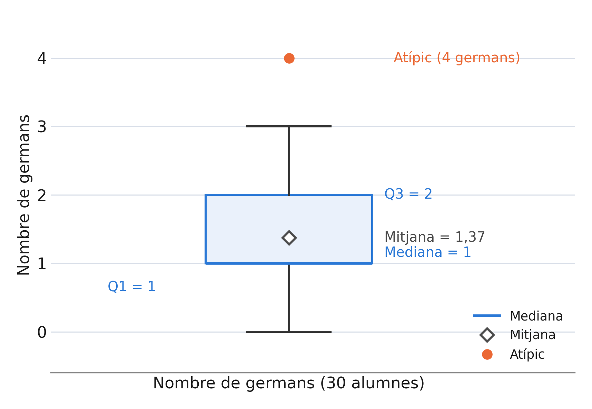
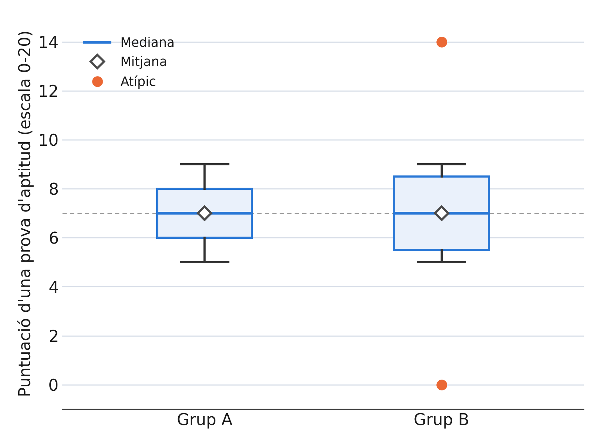

# Bloc 5 — Percentils, quartils i el diagrama de caixa

[:material-file-pdf-box: Descarrega la presentació (PDF)](../assets/presentacions/Bloc5_Teoria_Percentils_Boxplot.pdf){ .md-button }

Al [Bloc 3](03_mesures_centralitat.md) vam definir la mediana com el valor que deixa
el 50% de les dades per sota i el 50% per sobre. Aquesta idea es pot generalitzar: el
**percentil $p$** és el valor que deixa aproximadament el $p\%$ de les dades per sota
seu. El percentil 50 és, per definició, la mediana, i els percentils permeten
localitzar qualsevol posició dins la distribució, no només el centre.

!!! abstract "Definició: quartils"

    Els **quartils** divideixen les dades ordenades en quatre parts amb
    (aproximadament) el mateix nombre de dades a cada part:

    - $Q_1$ = percentil 25
    - $Q_2$ = percentil 50 = **mediana**
    - $Q_3$ = percentil 75

    Entre $Q_1$ i $Q_3$ hi ha, doncs, aproximadament el 50% central de les dades.

!!! info "Notació: localitzar un percentil amb una taula de freqüències"

    De la mateixa manera que la mediana és el primer $x_i$ amb $N_i/N \ge 0{,}5$,
    generalitzem la regla a qualsevol percentil $p$: el primer $x_i$ amb
    $N_i/N \ge p$.

!!! example "**Exemple:** quartils del nombre de germans de 30 alumnes"

    | $x_i$ | $n_i$ | $N_i$ | $N_i/N$ |
    |---|---|---|---|
    | 0 | 6 | 6 | 0,20 |
    | **1** | **12** | **18** | **0,60** |
    | **2** | **8** | **26** | **0,87** |

    $Q_1$: primer $x_i$ amb $N_i/N\ge0{,}25$ $\Rightarrow$ $Q_1=1$. $Q_3$: primer
    $x_i$ amb $N_i/N\ge0{,}75$ $\Rightarrow$ $Q_3=2$. (La mediana, com ja sabíem, és
    $Q_2=1$.)

!!! abstract "Definició: rang interquartílic (IQR)"

    $$
    IQR = Q_3 - Q_1
    $$

    A diferència de la desviació típica, l'IQR **ignora** el 25% de dades més
    petites i el 25% més grans, i es queda només amb el 50% central. Per això és una
    mesura de dispersió **robusta**: uns pocs valors extrems gairebé no l'alteren.

    **Exemple (germans):** $IQR = 2-1 = 1$.

!!! abstract "Definició: diagrama de caixa (boxplot)"

    Representació gràfica construïda a partir dels quartils, pensada per mostrar la
    dispersió i detectar valors atípics:

    1. Es dibuixa una caixa des de $Q_1$ fins a $Q_3$, amb una línia a la mediana.
    2. Es calculen uns **límits admissibles**: $LI = Q_1 - 1{,}5\cdot IQR$ i $LS = Q_3 + 1{,}5\cdot IQR$.
    3. Els **bigotis** arriben fins a la dada més allunyada que encara és dins de $(LI,LS)$ — no fins al límit mateix.
    4. Les dades fora de $(LI,LS)$ es marquen com a **valors atípics**.

!!! example "**Exemple:** diagrama de caixa del nombre de germans"

    Amb $Q_1=1$, mediana$=1$, $Q_3=2$, $IQR=1$:

    $$
    LI = 1-1{,}5\cdot1 = -0{,}5 \qquad LS = 2+1{,}5\cdot1 = 3{,}5
    $$

    Com que totes les dades van de 0 a 4, l'alumne amb **4 germans** queda fora de
    l'interval $(-0{,}5,\ 3{,}5)$: es marca com a valor atípic.

    

    El gràfic també hi mostra la mitjana (1,37): és una mica més alta que la mediana
    (1), perquè l'atípic l'estira cap amunt — un bon recordatori del que vam veure al
    Bloc 4.

!!! warning "Error habitual: pensar que els bigotis arriben fins a $LI$ i $LS$"

    $LI$ i $LS$ només marquen els **límits** a partir dels quals una dada es
    considera atípica; **no** són els extrems del bigotis. Els bigotis s'aturen a la
    dada real més allunyada que encara queda **dins** d'aquests límits. Al gràfic de
    dalt, $LI=-0{,}5$ i $LS=3{,}5$, però el bigot inferior arriba fins a 0 (la dada
    mínima real) i el superior fins a 3 (la dada més gran que no és atípica) — no
    fins a $-0{,}5$ ni fins a $3{,}5$.

## Interpretant la forma de la distribució

El boxplot no només mostra la dispersió: també revela si la distribució és
**simètrica** o no.

!!! tip "Propietat: llegir la simetria en un boxplot"

    - **Simètrica:** la mediana queda centrada dins la caixa, i els dos bigotis tenen una longitud semblant.
    - **Asimetria cap a la dreta** (cua de valors alts): la mediana s'apropa a $Q_1$ i/o el bigot superior és més llarg. La mitjana sol quedar **per sobre** de la mediana.
    - **Asimetria cap a l'esquerra** (cua de valors baixos): la mediana s'apropa a $Q_3$ i/o el bigot inferior és més llarg. La mitjana sol quedar **per sota** de la mediana.

    Comparar la posició de la mitjana i la mediana és una manera ràpida de
    detectar-ho.

!!! example "**Exemple:** la forma del boxplot dels germans"

    En el boxplot del nombre de germans hi coincideixen tres senyals: la mediana (1)
    coincideix amb $Q_1$ (1), hi ha un valor atípic només a la banda alta (4
    germans), i la mitjana (1,37) és més alta que la mediana. **Conclusió:** la
    distribució té una cua cap a la dreta (asimetria positiva) — la majoria
    d'alumnes tenen pocs germans (0 o 1), però una minoria en té força més.

## Comparant dos grups amb el diagrama de caixa

El boxplot és especialment útil per **comparar** la dispersió de diverses mostres o
poblacions d'un cop d'ull.

!!! example "**Exemple:** puntuació d'una prova d'aptitud (escala 0–20) en dos grups de 9 alumnes"

    - Grup A: 5, 6, 6, 7, 7, 7, 8, 8, 9
    - Grup B: 0, 5, 6, 7, 7, 7, 8, 9, 14

    Ambdós grups tenen la **mateixa mediana (7) i la mateixa mitjana (7)**, però...

    

    - Grup A: $Q_1=6$, $Q_3=8$ $\Rightarrow$ $IQR=2$, sense valors atípics.
    - Grup B: $Q_1=5{,}5$, $Q_3=8{,}5$ $\Rightarrow$ $IQR=3$, amb **dos valors atípics** (0 i 14).

    Quan comparem diagrames de caixa de diversos grups, cal fixar-se en la posició de
    la mediana i la mitjana, l'amplada de la caixa (IQR), la longitud dels bigotis i
    la presència de valors atípics. Aquí, els dos grups són prou simètrics —a
    diferència de l'exemple dels germans, l'asimetria no és el que els distingeix—
    però el Grup B és clarament **més variable** i presenta alumnes amb resultats
    molt allunyats de la resta: un cas clar en què la mitjana i la mediana, per si
    soles, amaguen diferències importants.

## Taula resum

| Concepte | Definició | Per a què serveix |
|---|---|---|
| Percentil $p$ | Valor que deixa el $p\%$ de les dades per sota | Localitzar qualsevol posició de la distribució |
| Quartils $Q_1,Q_2,Q_3$ | Percentils 25, 50 i 75 | Dividir les dades en quatre parts iguals |
| IQR $=Q_3-Q_1$ | Amplada del 50% central | Mesura de dispersió robusta |
| Boxplot | Caixa + bigotis + atípics | Visualitzar dispersió, simetria i comparar grups |

!!! note "Nota històrica"

    El diagrama de caixa és, dels que hem vist al curs, el més jove amb diferència:
    el matemàtic i estadístic John Tukey en va esbossar la idea cap al 1970, però
    no es va donar a conèixer públicament fins al 1977, al seu llibre *Exploratory
    Data Analysis* —una obra que va popularitzar la idea de "mirar" les dades
    gràficament abans de llançar-se a calcular-hi res, exactament l'esperit amb què
    hem treballat en aquest bloc.

Amb la taula de freqüències, els gràfics i les mesures de centralitat i dispersió ja
treballats, tenim les eines bàsiques de l'estadística descriptiva. El proper pas del
curs és la **recta de regressió**, que veurem quan tinguem el material preparat.
